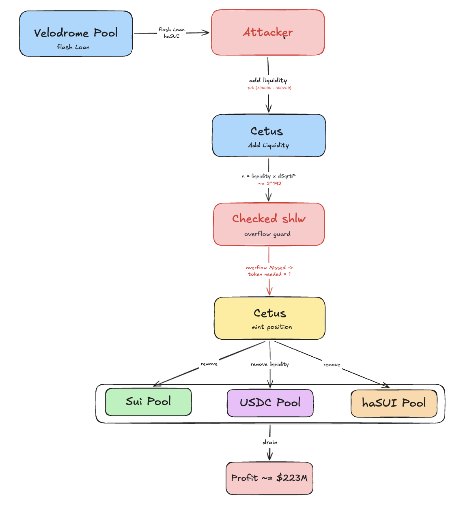
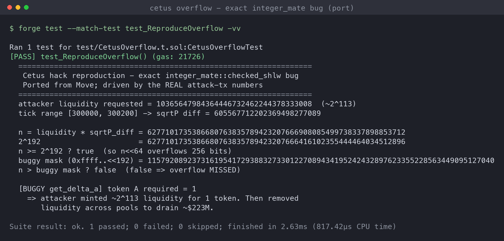
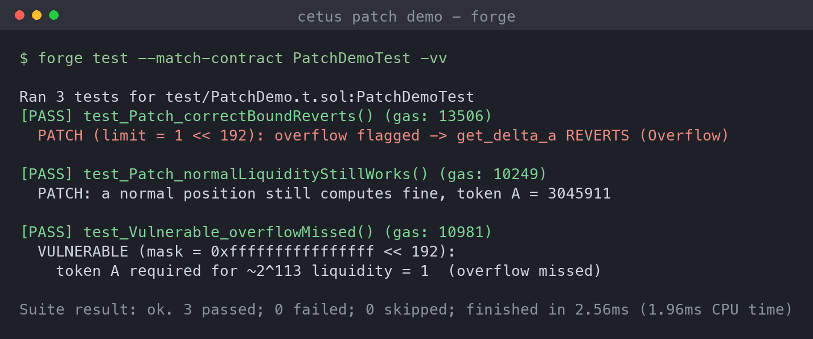

# Cetus DEX: Integer Overflow in the Liquidity Math

> **Incident summary.** On **2025-05-22**, Cetus Protocol, the largest AMM/DEX on **Sui** (with a deployment on Aptos), was drained of **~$223M in under 15 minutes**. The root cause was a wrong overflow check in a **shared fixed-point math library** (`integer_mate`): the `checked_shlw` function compared its input against `0xffffffffffffffff << 192` instead of `1 << 192`, so a value that overflowed on a 64-bit left shift was **not flagged**. That silent overflow corrupted the add-liquidity token-amount calculation (`get_delta_a`), making the protocol think a position worth **~2^113 liquidity** required only **1 token**. The attacker opened a narrow-range position, added enormous liquidity for 1 token, then removed liquidity to drain the pools. Of the ~$223M, roughly **$60M was bridged to Ethereum** and **~$162M was frozen on Sui** (validators censored the attacker) and later recovered via governance, treasury, and a Sui Foundation loan.

## Background

Cetus is a **concentrated-liquidity AMM** (Uniswap-V3 style) written in **Move** on Sui. Liquidity providers pick a price range (`tick` range); the protocol computes how much of each token a position needs from the range's square-root prices and the requested liquidity.

The relevant function, `get_delta_a`, computes the amount of token A required to mint a given `liquidity` between two sqrt prices:

```move
// simplified
sqrt_price_diff = sqrt_price_1 - sqrt_price_0;
numerator = checked_shlw( full_mul(liquidity, sqrt_price_diff) ); // (liquidity * dP) << 64
denominator = full_mul(sqrt_price_0, sqrt_price_1);
delta_a = div_round(numerator, denominator, round_up);
```

`checked_shlw(n)` is meant to compute `n << 64` and report whether that shift overflows a 256-bit word. Shifting left by 64 overflows exactly when the top 64 bits are set, i.e. when `n >= 2^192`. The whole safety of the liquidity accounting rests on that one boolean.

## The Bug

The overflow guard used the wrong bound:

```move
public fun checked_shlw(n: u256): (u256, bool) {
    let mask = 0xffffffffffffffff << 192;   // WRONG: this is ~2^256, not 2^192
    if (n > mask) {
        (0, true)          // report overflow
    } else {
        ((n << 64), false) // otherwise shift  <-- silent overflow here
    }
}
```

- The intended bound is `1 << 192` (`2^192`).
- `0xffffffffffffffff << 192` equals `(2^64 - 1) * 2^192`, which is just below `2^256`.
- So for any `n` in the range **`[2^192, 2^256 - 2^192)`**, the check `n > mask` is **false**, the function returns `overflow = false`, and then `n << 64` **wraps around modulo 2^256** to a near-zero value.

A wrapped, near-zero `numerator` divided by the real denominator makes `get_delta_a` return **1**. The caller (`assert!(!overflowing)`) never trips, so the position is minted as if 1 token fully paid for it.

## Attack Flow



1. **Flash loan.** The attacker flash-borrows haSUI for working capital.
2. **Open a narrow position.** Tick range `[300000, 300200]` (a tiny, high range) so the sqrt-price difference and chosen liquidity push `n = liquidity * ΔsqrtP` just above `2^192`.
3. **Add ~2^113 liquidity.** `get_delta_a` runs `checked_shlw` on `n ≈ 2^192`. The wrong mask misses the overflow, `n << 64` wraps, and the required token A collapses to **1**.
4. **Deposit 1 token, get a massive position.** The attacker is credited ~2^113 of liquidity for a single token.
5. **Remove liquidity.** Withdrawing that position pulls real tokens out of the pools. Repeated across pools, this drained ~$223M in minutes.
6. **Repay the flash loan** and keep the difference; part was bridged to Ethereum, part stayed on Sui and was frozen.

The core: no oracle, no reentrancy, no access-control slip. A single wrong constant in a math library turned "mint huge liquidity" into "costs 1 token."

## The Problem (Root Cause)

**A shared fixed-point math library reported "no overflow" for values that do overflow, corrupting every calculation built on it.**

- **Wrong overflow bound.** `checked_shlw` compared against `0xffffffffffffffff << 192` instead of `1 << 192`, leaving the entire band `[2^192, 2^256 - 2^192)` unguarded.
- **Silent wraparound.** Move's `<<` (like most low-level shifts) drops high bits without reverting, so an unflagged overflow produces a plausible-but-wrong small number rather than a crash.
- **A single boolean gated real value.** `get_delta_a` trusted the overflow flag completely; once it said "fine," a 2^113 position was priced at 1 token.
- **Shared/forked library blast radius.** `integer_mate` underpins the core AMM math, so one library bug was reachable from ordinary user actions (open position, add liquidity).

In short: the safety check that was supposed to catch the overflow was itself wrong, so the overflow it was guarding became free money.

## Local Reproduction: Faithful Port of the Vulnerable Math

Cetus runs on **Sui (Move)**, which is not EVM-forkable, so a chain fork is not possible here. Instead the PoC **ports the exact vulnerable functions** (`checked_shlw`, `get_delta_a`) to Solidity and drives them with the **real attack-transaction numbers**. Solidity's `<<` truncates high bits with no revert, exactly like the Move u256 shift, so the silent overflow reproduces identically.



Using the real values (liquidity `≈ 2^113`, tick range `[300000, 300200]`, the two sqrt prices):

- `n = liquidity * ΔsqrtP = 6.2771…e57`, which is **`≥ 2^192`** (so `n << 64` genuinely overflows 256 bits).
- The buggy mask `0xffffffffffffffff << 192 ≈ 2^256`, so `n > mask` is **false**: the overflow is **missed**.
- `get_delta_a` therefore returns **token A required = 1** for a `~2^113` position.

Test: [`cetus-poc/test/CetusOverflow.t.sol`](cetus-poc/test/CetusOverflow.t.sol).

## Patch / Remediation

### 1. Use the correct overflow bound (the actual fix)
`checked_shlw` must flag overflow when `n >= 1 << 192`, not `n > 0xffffffffffffffff << 192`. Cetus's fix changed the comparison to the correct `2^192` limit, so any value that would overflow the `<< 64` is rejected.

### 2. Prefer checked/reverting arithmetic over hand-rolled guards
A manual "compute a mask and compare" is exactly the kind of code that hides an off-by-a-lot constant. Where possible, use arithmetic that reverts on overflow by construction, or well-tested wide-multiply/shift primitives, rather than bespoke boolean guards.

### 3. Fuzz and boundary-test the math library
The bug lives entirely at the `2^192` boundary. Property tests ("`checked_shlw` flags overflow iff `n >= 2^192`") and fuzzing around powers of two would have caught it immediately, independent of the AMM logic on top.

### 4. Treat shared/forked libraries as first-class audit targets
`integer_mate` is a shared dependency; a single wrong constant propagated into every consumer. Shared math libraries deserve the same scrutiny (and invariant tests) as the protocol contracts that use them.

**Priority order:** (1) the correct bound closes the hole; (2)-(3) make the class of bug non-recurring; (4) widens the audit net so the next shared-library constant does not slip through.

### Verifying the patch

Driving the same real attack numbers through the buggy vs corrected bound:



- **Vulnerable (`mask = 0xffffffffffffffff << 192`):** token A required for a ~2^113 position collapses to **1** (overflow missed).
- **Patch (`limit = 1 << 192`):** the overflow is flagged, so `get_delta_a` **reverts (`Overflow`)** and the position cannot be minted.
- **Sanity:** an ordinary in-range position still computes a normal, nonzero token amount under the patched bound, so the fix does not break legitimate use.

Code: [`cetus-poc/src/CetusMath.sol`](cetus-poc/src/CetusMath.sol), [`cetus-poc/test/PatchDemo.t.sol`](cetus-poc/test/PatchDemo.t.sol).

## Takeaways

- **A wrong safety check is worse than no check.** `checked_shlw` looked safe and was trusted precisely because it existed; the wrong bound made every caller confidently wrong. Guards need their own tests.
- **Overflow bugs love boundaries.** The entire exploit lives at `n = 2^192`. Boundary and power-of-two fuzzing on low-level math is cheap and would have caught it.
- **Shared libraries concentrate risk.** One constant in `integer_mate` was reachable from a normal "add liquidity" call and cost ~$223M. Forked or shared math deserves top-tier review.
- **Chain matters for reproduction, not for the lesson.** Sui/Move is not EVM, but the bug is pure arithmetic; porting the exact functions with the real numbers reproduces it faithfully, and the same class of overflow-guard bug applies to Solidity fixed-point math too.

## References

- [Dedaub: The Cetus AMM $200M Hack, How a Flawed Overflow Check Led to Catastrophic Loss](https://dedaub.com/blog/the-cetus-amm-200m-hack-how-a-flawed-overflow-check-led-to-catastrophic-loss/)
- [Cyfrin: Inside the $223M Cetus Exploit, Root Cause and Impact Analysis](https://www.cyfrin.io/blog/inside-the-223m-cetus-exploit-root-cause-and-impact-analysis)
- [Three Sigma: Cetus Protocol $223M Hack, Deep Technical Dive into the Arithmetic Overflow Exploit](https://x.com/threesigmaxyz/status/1926971295708627337)
- [QuillAudits: Cetus Protocol Hack, Overflow Bug Leads to $223M Loss](https://www.quillaudits.com/blog/hack-analysis/cetus-protocol-hack-analysis)
- [Halborn: Explained, The Cetus Hack (May 2025)](https://www.halborn.com/blog/post/explained-the-cetus-hack-may-2025)
- [Merkle Science: How a Shared Library Bug Triggered the $223M Cetus Hack](https://www.merklescience.com/blog/hack-track-how-a-shared-library-bug-triggered-the-223m-cetus-hack)
- [The Block: Cetus restarts platform after recovering from $223M exploit](https://www.theblock.co/post/357386/sui-dex-cetus-protocol-restarts-platform-after-recovering-from-223-million-exploit)
- Reproduction PoC: [`cetus-poc/`](cetus-poc/) (Foundry; Solidity port of the exact Move math, real attack numbers)
