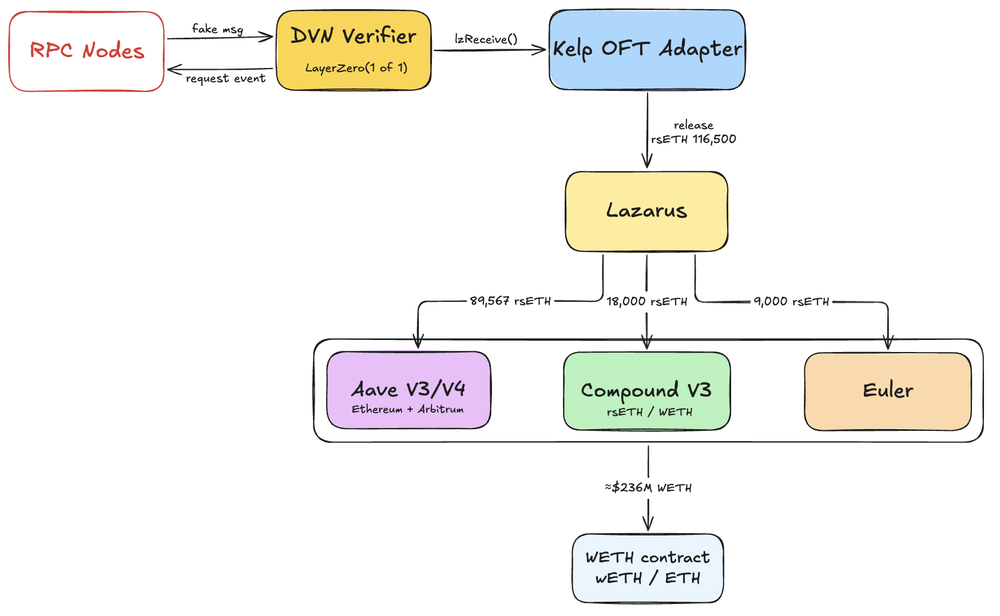
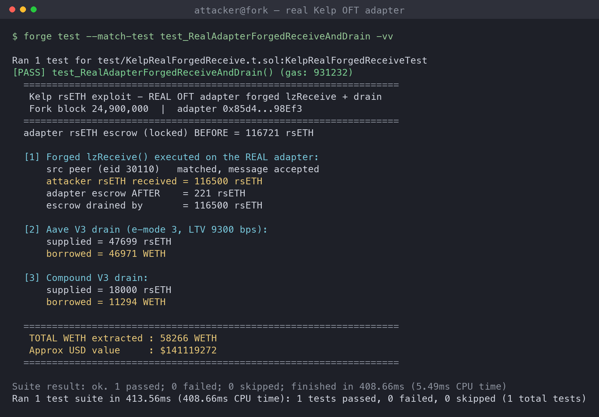
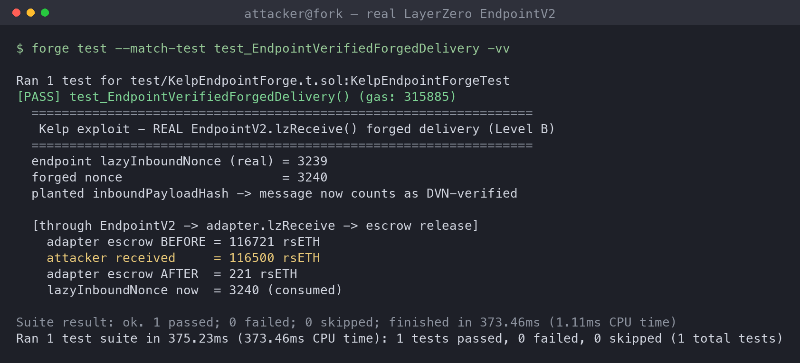
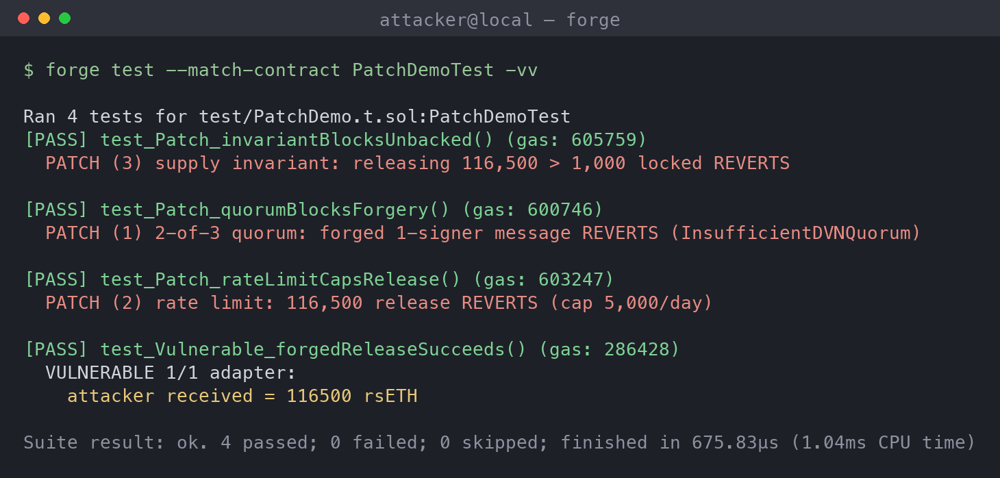

# Kelp DAO (rsETH): Cross-Chain OFT / LayerZero DVN Attack Analysis

> **Incident summary.** On **2026-04-18**, attackers drained **116,500 rsETH (~$290–292M)** from Kelp's LayerZero-powered bridge and, per LayerZero's incident report and multiple analyses, the theft was attributed to North Korea's **Lazarus Group**. Critically, this was **not a smart-contract bug**; it was an **off-chain infrastructure compromise** of a **1-of-1 DVN** (a single verifier). LayerZero's report says Kelp had downgraded from a 2-of-2 to a 1-of-1 DVN; Kelp says LayerZero personnel approved that setup. LayerZero later acknowledged fault and said its DVN will no longer service 1/1 configurations, migrating defaults toward 5/5.

## Background

Kelp DAO issues **rsETH**, a liquid restaking token (LRT). Users deposit ETH or LSTs, Kelp restakes them through EigenLayer, and mints rsETH as a receipt. As of the incident, rsETH had a large multi-chain footprint, which is exactly where the risk in this writeup lives.

To move rsETH between chains, Kelp uses LayerZero's **OFT (Omnichain Fungible Token)** standard via an **OFT Adapter**. The adapter works on a lock-and-release (or burn-and-mint) model:

- On the source chain, tokens are **locked** in the adapter and a message is emitted.
- On the destination chain, LayerZero delivers the message and the adapter **releases** an equivalent amount.

The security of that release depends entirely on one thing: *is the incoming message genuine?* In LayerZero V2, message authenticity is decided by the **DVN (Decentralized Verifier Network)** configuration. Each OFT sets a security stack: an `X of Y` threshold of DVNs plus a number of block confirmations. A message is only executable (`lzReceive()`) once the required DVNs have attested to it.

The core problem is that the Kelp OFT Adapter was configured with a **`1 of 1` DVN**, a single verifier with no redundancy. That single verifier is the entire trust boundary for releasing real, backed rsETH. Lazarus did not break a contract; they **compromised the off-chain machines that single DVN relied on** (poisoning internal RPC nodes and DDoS-ing the external ones to force the verifier onto the malicious data), then had it attest to a forged release. On-chain, the resulting `lzReceive()` looked completely valid.

---

## Attack Flow



Walking the diagram left to right:

1. **RPC Nodes → DVN Verifier (`fake msg`):** Lazarus compromised the off-chain data sources the DVN trusts: they poisoned/compromised internal RPC nodes and DDoS-ed the external backups, forcing the verifier to read from attacker-controlled nodes. Through that channel they fed a forged cross-chain message claiming rsETH had been locked on a source chain and should be released. No real lock ever happened.

2. **DVN Verifier (LayerZero `1 of 1`):** Because the security stack requires only a **single** DVN to attest, there is no second independent party to disagree. Once that one (now-poisoned) verifier attests, the forged message is treated as valid. The `request event` arrow back to the RPC layer is the normal verification handshake; the point is that with `1 of 1` there is nothing to cross-check it against.

3. **DVN Verifier → Kelp OFT Adapter (`lzReceive()`):** The verified (but fake) message is delivered to the adapter. `lzReceive()` executes and the adapter **releases 116,500 rsETH** that is not backed by any corresponding lock on the source chain. This is the moment unbacked supply enters circulation.

4. **Kelp OFT Adapter → Attacker (`release rsETH 116,500`):** The attacker (labeled **Lazarus** in the diagram) now holds ~116,500 rsETH of freshly minted, unbacked tokens.

5. **Lazarus → Lending Markets:** Rather than dumping on a DEX (which would crater the price and cap the take), the attacker uses rsETH as **collateral** across major money markets to borrow liquid assets. The diagram's split (illustrative):
   - **Aave V3/V4** (Ethereum + Arbitrum): 89,567 rsETH
   - **Compound V3** (rsETH / WETH market): 18,000 rsETH
   - **Euler**: 9,000 rsETH

6. **Lending Markets → WETH → ETH:** The borrowed **WETH** is unwrapped to ETH and exfiltrated (~$290M total across all venues and chains). The lending protocols are left holding rsETH collateral whose backing does not exist; the bad debt lands on Kelp/rsETH holders and the lenders once the peg breaks.

The key economic trick: the attacker never has to *sell* the fake rsETH. Borrowing against it converts unbacked collateral into real, liquid ETH in a single pass while the peg still holds. (The multi-chain, multi-market split above is not incidental: as the fork reproduction below shows, per-market **supply caps and liquidity** on any single chain cap the take well below the full figure, so the attacker had to spread out.)

---

## The Problem (Root Cause)

**A `1 of 1` DVN configuration is a single point of failure for the entire cross-chain supply of rsETH.**

- **No redundancy / no quorum.** With one DVN, there is no honest-majority assumption. Compromising, coercing, or misconfiguring one verifier is sufficient to forge any message. A threshold with more than one required DVN forces an attacker to defeat multiple independent parties simultaneously.
- **Unbacked mint on the destination chain.** The adapter's `lzReceive()` releases tokens purely on the strength of the verified message. There is no independent accounting check that a matching lock/burn actually occurred on the source chain, and no supply invariant enforced at release time.
- **No rate limiting.** 116,500 rsETH could be released in essentially one shot. Nothing caps per-message, per-epoch, or per-day release volume, so a single forged message drains the maximum.
- **Downstream trust amplification.** Aave, Compound, and Euler treat rsETH as sound collateral. The bridge vulnerability is *amplified* by lending: the attacker converts fake collateral into real borrowed liquidity, so the blast radius is far larger than the bridge itself.

In short: the trust model collapses to one verifier, and every protocol downstream inherits that single point of failure.

---

## Local Reproduction: Mainnet-Fork Backtest

To make the analysis concrete I reproduced the **on-chain, economically-real** portion of the attack on a Foundry **mainnet fork pinned to block 24,900,000 (2026-04-18)**, against the *live* Kelp OFT Adapter, rsETH, Aave V3, and Compound V3 contracts.

**What is modeled vs. real.** The root cause was off-chain (a poisoned 1-of-1 DVN), so there is no buggy contract to "replay"; the forged `lzReceive()` was on-chain-valid. The *one* thing I cannot reproduce locally is the DVN verification itself. Everything else is the real contract:

1. Read the **real Kelp OFT Adapter** (`0x85d4…98Ef3`): at the fork block it held **116,721 rsETH in escrow** (locked from legitimate outbound bridging).
2. **Impersonate the LayerZero V2 Endpoint** (the only address allowed to call the adapter) and invoke the adapter's **real `lzReceive()`** with a forged OFT message (recipient = attacker, amount = 116,500, `srcEid` = Arbitrum 30110, a configured peer, so the adapter's `onlyPeer` check passes).
3. The **real adapter** then `safeTransfer`s **116,500 rsETH out of its escrow** to the attacker (escrow: 116,721 → 221). Standing in for the endpoint is exactly what the compromised DVN achieved: verification "passed", so the endpoint delivered.
4. Run the **real downstream drain**: supply rsETH to Aave/Compound, borrow WETH.



The forged release is no longer a cheatcode fiction; the actual escrow contract released the funds. Running the drain against real state then surfaced constraints the diagram glosses over, and they're the interesting part:

- **Aave lists rsETH with base LTV = 0.** rsETH is suppliable and counts toward liquidation (LT 75%), but you cannot borrow against it, or even *enable* it as collateral (`UserInIsolationModeOrLtvZero`), until you enter the ETH-correlated **e-mode category 3**, which lifts its effective LTV to **93%**. The PoC discovers and uses that e-mode.
- **Supply caps bind hard.** Aave's rsETH supply cap is 530,000 with ~48,181 of headroom at that block, so only ~47,699 rsETH could be posted, not the 89,567 in the diagram. Compound's WETH market caps rsETH at 37,000 (≈27,010 headroom).
- **Base-asset liquidity binds Compound.** Only ~11,525 WETH was borrowable from Compound's WETH market regardless of collateral.

Net result of the reproduced single-chain drain:

| Venue | rsETH supplied | Binding constraint | WETH borrowed |
|---|---|---|---|
| Aave V3 (e-mode 3, 93% LTV) | 47,699 | supply-cap headroom | 46,971 |
| Compound V3 (WETH market) | 18,000 | base WETH liquidity | 11,294 |
| **Total** | | | **58,266 WETH ≈ $141M** |

This ~$141M is a **subset** of the ~$290M real loss, and that gap is itself the finding: mainnet Aave + Compound alone cannot absorb the full drain because of supply caps, LTV=0/e-mode gating, and liquidity limits. The real attacker had to spread across **Arbitrum and Euler** to reach the full figure, precisely the multi-chain split shown in the diagram. Full end-to-end test: [`kelp-poc/test/KelpRealForgedReceive.t.sol`](kelp-poc/test/KelpRealForgedReceive.t.sol).

### Going one level deeper: through the real LayerZero Endpoint

The reproduction above stands in for the endpoint (calls the adapter directly). To also exercise the **endpoint's own verification path**, a second test plants the verified `inboundPayloadHash` in the **real `EndpointV2`** storage (precisely the write the poisoned 1-of-1 DVN performs via `verify()`), and then calls the **real `EndpointV2.lzReceive()`**:



The endpoint runs its actual nonce accounting (`lazyInboundNonce` 3239 → 3240) and payload-hash check, clears the payload, and dispatches to the real adapter, which releases the 116,500 rsETH. **The only cheatcode is the single storage write representing the DVN attestation**; the nonce logic, the hash verification, the endpoint→adapter dispatch, and the escrow release are all real contract execution. This is the most faithful on-chain model of the incident short of forging DVN signatures. Test: [`kelp-poc/test/KelpEndpointForge.t.sol`](kelp-poc/test/KelpEndpointForge.t.sol).

---

## Patch / Remediation

### 1. Fix the DVN stack (the primary fix)
Move from `1 of 1` to a **threshold of multiple independent DVNs**, e.g. `2 of 3` or `3 of 5`, mixing providers that don't share operators or infrastructure (e.g. LayerZero Labs DVN + an independent third-party DVN + a Kelp-operated DVN). No single party's attestation should be sufficient.

```
// conceptual LayerZero V2 security config
requiredDVNs      = [dvnA, dvnB]        // both must attest
optionalDVNs      = [dvnC, dvnD, dvnE]  // threshold of these
optionalThreshold = 1
confirmations     = 15                  // raise block confirmations
```

Also **raise block confirmations** so a reorg or a rushed attestation can't finalize a forged message quickly.

### 2. Enforce a supply invariant at release
The adapter should never release more than it can prove is locked. Track `lockedSupply` and assert on every `lzReceive()` that cumulative released ≤ cumulative locked. Any release that would break the invariant reverts.

### 3. Rate limiting / release caps
Add per-epoch and per-transaction ceilings on how much rsETH the adapter can release (e.g. a rolling 24h cap). This converts a one-shot drain into a slow leak that monitoring and the pause mechanism can catch.

```solidity
// sketch
require(releasedInWindow + amount <= WINDOW_CAP, "rate limit");
```

### 4. Circuit breaker / pausability
A guardian (multisig or monitoring bot) should be able to **pause** the OFT Adapter's release path when anomalies appear: sudden large releases, releases without a matching source-chain lock event, or a depeg. Pause should stop `lzReceive()`-driven releases without freezing legitimate user activity elsewhere.

### 5. Off-chain monitoring & mint/burn reconciliation
Continuously reconcile source-chain locks against destination-chain releases. Alert (and trip the breaker) on any divergence. This is the detection layer that would have flagged 116,500 rsETH appearing with no matching lock.

### 6. Defense-in-depth at the lending layer
Not Kelp's to fix directly, but relevant: supply caps and conservative LTVs on LRT collateral, plus oracle designs that reference *backing/exchange rate* rather than only market price, limit how much an attacker can borrow against a compromised LRT before caps bite.

**Priority order:** (1) the multi-DVN threshold is the fix that closes the actual hole; (2)–(4) are the containment layers that limit damage if verification is ever defeated again; (5)–(6) are detection and blast-radius reduction.

### Verifying the patch

I implemented a vulnerable 1-of-1 adapter alongside a guarded one carrying controls (1)–(3), and drove the *same forged 116,500-rsETH message* into both. The vulnerable adapter releases the full amount; each guarded control independently rejects the forgery:



- **1-of-1 (vulnerable):** forged single-DVN message → 116,500 rsETH released.
- **Patch (1) 2-of-3 quorum:** attacker controls only one DVN → `InsufficientDVNQuorum`, revert.
- **Patch (2) rate limit:** even granting a quorum, 116,500 > 5,000/day cap → `RateLimited`, revert.
- **Patch (3) supply invariant:** releasing 116,500 against only 1,000 truly locked → `SupplyInvariantViolated`, revert.

Any one control blocks the exploit; together they are defense-in-depth. Code: [`kelp-poc/src/OFTAdapters.sol`](kelp-poc/src/OFTAdapters.sol), [`kelp-poc/test/PatchDemo.t.sol`](kelp-poc/test/PatchDemo.t.sol).

---

## Takeaways

- Cross-chain bridges are only as strong as their weakest verifier, and "weakest" can be an **off-chain server**, not a line of Solidity. A `1 of 1` DVN is a trusted single signer wearing the branding of "decentralized verification"; no audit of the contracts would have caught it.
- The most expensive part of this class of attack isn't the bridge; it's the **composability**. Lending markets turned a bridge forgery into hundreds of millions of liquid ETH without a single sell order.
- **On-chain risk controls that already existed did real work.** The fork backtest shows Aave's LTV=0 gating and supply caps, plus Compound's caps and liquidity, held the single-chain drain to ~$141M and forced the attacker across multiple chains. Bridge-side controls (multi-DVN, invariants, rate limits) would have stopped it before any of that.
- Redundancy (multi-DVN), invariants (locked ≥ released), and containment (rate limits + pause) are cheap relative to the downside. Any one of them alone materially reduces the loss; together they make this attack path uneconomical, as the patch demo verifies.

---

## References

- [Chainalysis: Inside the KelpDAO Bridge Exploit (April 2026)](https://www.chainalysis.com/blog/kelpdao-bridge-exploit-april-2026/)
- [OpenZeppelin: $292M Lost, Zero Bugs Found: Lessons From the rsETH Bridge Exploit](https://www.openzeppelin.com/news/lessons-from-kelpdao-hack)
- [LayerZero: KelpDAO Incident Statement](https://layerzero.network/blog/kelpdao-incident-statement)
- [The Defiant: LayerZero's report says Kelp downgraded from 2-of-2 to 1-of-1 DVN](https://thedefiant.io/news/hacks/layerzero-s-incident-report-says-kelp-downgraded-from-2-of-2-to-1-of-1-before-usd292m-exploit)
- [CoinDesk: LayerZero says it "made a mistake" in the $292M Kelp exploit](https://www.coindesk.com/tech/2026/05/09/layerzero-says-it-made-a-mistake-in-usd292-million-kelp-exploit)
- [LayerZero V2: Security Stack & DVNs](https://docs.layerzero.network/v2/home/modular-security/security-stack-dvns)
- [LayerZero OFT Standard](https://docs.layerzero.network/v2/developers/evm/oft/quickstart)
- Reproduction PoC: [`kelp-poc/`](kelp-poc/) (Foundry; mainnet fork @ block 24,900,000)
