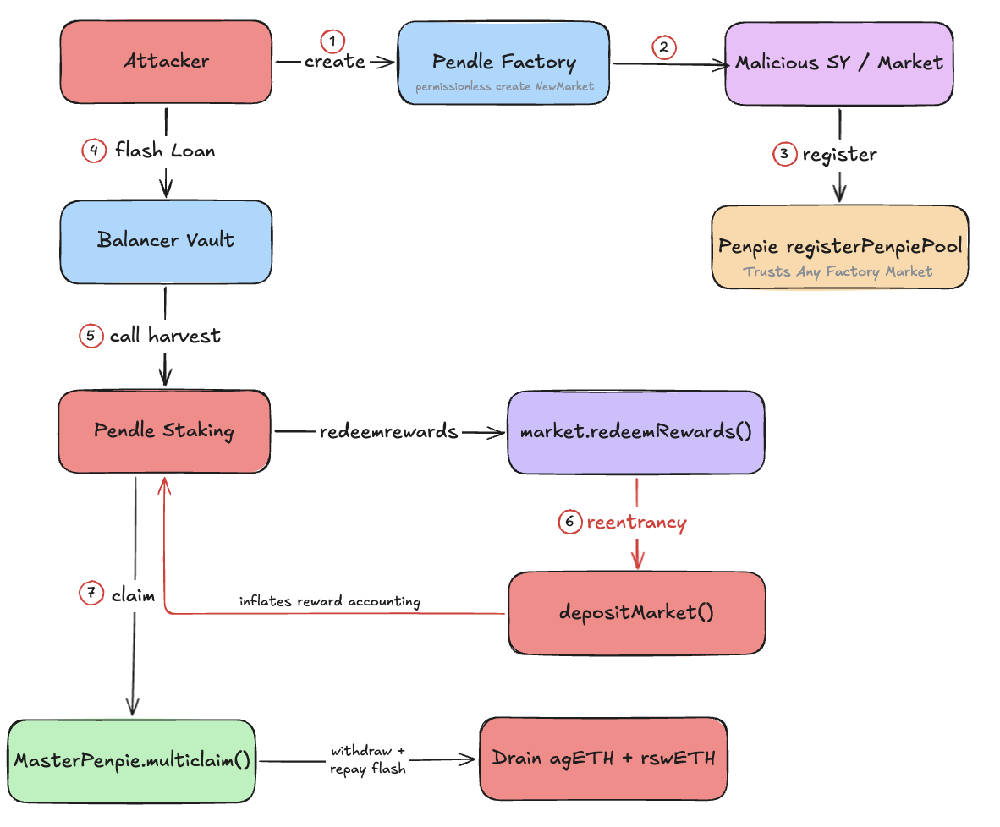
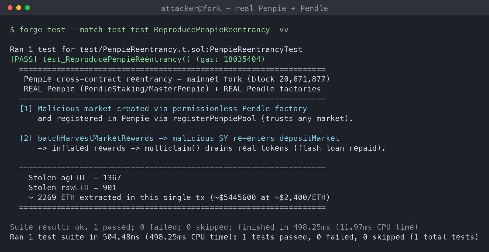
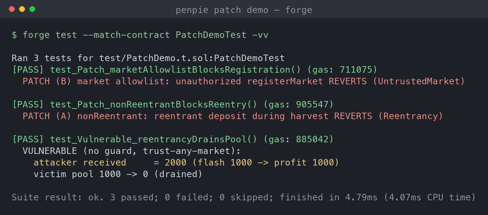

# Penpie: Cross-Contract Reentrancy via a Malicious Pendle Market

> **Incident summary.** On **2024-09-03** (~18:23 UTC), Penpie, a yield/veTokenomics booster built on top of Pendle Finance, was drained of **~$27M** across Ethereum and Arbitrum in three transactions. The root cause was a **cross-contract reentrancy** in `PendleStakingBaseUpg.batchHarvestMarketRewards()` (no reentrancy guard) combined with **permissionless market registration**: `PendleMarketRegisterHelper.registerPenpiePool()` trusted any market created by Pendle's permissionless factory. The attacker registered a market backed by a **malicious SY contract**; during reward harvest that SY re-entered `depositMarket()` with **flash-loaned** funds so its own deposit was counted as reward, then `MasterPenpie.multiclaim()` drained the real reward tokens (agETH, rswETH, wstETH, sUSDe, egETH). Attacker `0x7a2f4d…1d1b` funded via Tornado Cash.

## Background

Pendle splits a yield-bearing asset into **PT** (principal) and **YT** (yield) around a **SY** (standardized yield) wrapper, and pairs PT/SY in an AMM **market**. Providing liquidity to a market gives an **LP token**, which accrues reward tokens (the underlying's secondary rewards plus PENDLE incentives).

**Why Penpie exists.** Pendle uses a veToken model: locking PENDLE for up to two years mints non-transferable **vePENDLE**, which multiplies your LP reward emissions (up to ~2.5x). Locking for years is impractical for most LPs, so Penpie pools everyone's PENDLE, locks it collectively to hold a large vePENDLE position, and lets users deposit just their **Pendle LP** (no personal lock, withdraw anytime) to ride that boost while Penpie auto-compounds. This is the same relationship Convex has with Curve. The side effect: large amounts of LP and PENDLE concentrate inside Penpie's contracts, making the reward-harvest path a high-value target.

Concretely: users stake Pendle LP through Penpie's `PendleStaking`, Penpie harvests each market's rewards via `batchHarvestMarketRewards()`, and users claim via `MasterPenpie`. Two Penpie design decisions combined into the hole:

- **Permissionless market onboarding.** Anyone can create a Pendle market through Pendle's public `PendleYieldContractFactory` / `PendleMarketFactoryV3`. Penpie's `registerPenpiePool()` accepted any such market as a valid Penpie pool, with no vetting of the market's SY.
- **Reward harvest trusts the market's SY.** To collect rewards, Penpie calls into the market, which calls the SY's `claimRewards()`. Because the SY is arbitrary attacker code, that call hands control back to the attacker in the middle of Penpie's reward accounting, and `batchHarvestMarketRewards()` had no reentrancy guard.

Put together: the attacker gets to run their own code inside Penpie's reward calculation, from a market Penpie was willing to trust.

## Attack Flow

1. **Create a malicious market.** The attacker deploys a contract that acts as a **malicious SY**, then uses Pendle's permissionless `createYieldContract` + `createNewMarket` to spin up PT/YT and a market around it.
2. **Point the market at attacker code.** The market's SY is the attacker contract, so every reward callback runs attacker logic.
3. **Register it in Penpie.** `registerPenpiePool()` accepts the market with no validation, so Penpie now treats it as a legitimate pool.
4. **Flash loan.** The attacker borrows agETH / rswETH (and others) from Balancer to have real assets to inject mid-harvest.
5. **Call harvest.** `batchHarvestMarketRewards()` starts computing rewards as a **balance delta** around an external market call, with no reentrancy guard.
6. **Re-enter.** The market's `redeemRewards()` calls the malicious SY's `claimRewards()`, which **re-enters `depositMarket()`** and deposits the flash-loaned funds mid-harvest. That deposit inflates the balance delta, so Penpie credits the attacker a massively inflated reward.
7. **Claim and exit.** `MasterPenpie.multiclaim()` pays out the inflated reward in real tokens; the attacker withdraws its reentrant deposit, repays the flash loan, and keeps the difference.

The core trick is cross-contract: no single Penpie function is obviously broken, but harvest hands control to attacker code that mutates the very state harvest is mid-way through reading.

## The Problem (Root Cause)

**Attacker-controlled code runs inside an unguarded reward computation, from a market the protocol trusted for free.**

- **No reentrancy guard on harvest.** `batchHarvestMarketRewards()` measured reward as `balanceAfter - balanceBefore` around an external call and never locked, so a reentrant `depositMarket()` could change balances and staked shares mid-computation.
- **Permissionless, unvalidated market registration.** `registerPenpiePool()` trusted any Pendle-factory market, so the attacker could insert a market whose SY was arbitrary code into Penpie's trusted reward path.
- **Trusting external-market data as if safe.** Penpie assumed reward tokens and amounts reported by the market/SY were honest. The malicious SY set the reward tokens to valuable assets and returned flash-loaned balances as "rewards".
- **Flash loans remove the capital barrier.** Balancer flash loans let the attacker momentarily control enough assets to make the inflated deposit dwarf real yield.

In short: a trusted call into untrusted code, with no lock and no validation, let the attacker mint rewards out of a flash loan.

### How the inflated reward actually works: one deposit, counted twice

The harvest measures reward as "how much did the reward-token balance go up" (`balanceAfter - balanceBefore`) around the external `redeemRewards()` call. During that measurement window the malicious SY re-enters and calls `depositMarket()` with flash-loaned funds. That single deposit then gets booked **twice**:

1. As the attacker's **own deposit** (the normal effect of `depositMarket`, still withdrawable), and
2. As **"reward earned"** (because the balance went up during the harvest window), credited to the attacker's market position.

The attacker then withdraws the deposit **and** claims the inflated reward, so one flash-loaned 1,000 comes back out as ~2,000, with the extra 1,000 paid from other users' tokens. The reward is fictitious because the balance increase did not come from yield earned outside; it was the attacker's own principal, injected and then reclaimed.

### Two ways to frame it (and why either fix works)

- **The mechanism (how):** reentrancy. External attacker code runs mid-harvest and slips a deposit into the measurement window.
- **The corrupted invariant (what pays out):** the balance-delta accounting treats *any* balance increase as reward, without checking whether it came from real yield or from a fresh deposit.

These are two layers of the same bug. Note that balance-delta accounting is actually safe **on its own**: without reentrancy, nothing can change the balance between `before` and `after`, so the delta only reflects genuine rewards. It breaks **only because** reentrancy lets a deposit land inside the window. That is why fixing *either* layer independently closes the exploit: a `nonReentrant` lock stops the deposit from entering the window, and pull-based reward accounting stops a mid-window deposit from ever being read as reward.

## Local Reproduction: Mainnet-Fork Backtest

This is a genuine smart-contract bug, so it is fully replayable. The PoC runs the **actual exploit against the real deployed Penpie and Pendle contracts** on an Ethereum mainnet fork at **block 20,671,877** (one before the first attack transaction). Exploit logic adapted from the DeFiHackLabs PoC (author: rotcivegaf).

The reproduction, all against real contracts:

- Creates a malicious-SY-backed market via the **real Pendle factories** and registers it through the **real `PendleMarketRegisterHelper`** (proving registration is permissionless).
- Flash-loans agETH/rswETH from the **real Balancer vault**, calls the **real `PendleStaking.batchHarvestMarketRewards()`**, and re-enters `depositMarket()` from the malicious SY.
- Drains via the **real `MasterPenpie.multiclaim()`**, then repays the flash loan.

Result of the reproduced transaction: **1,367 agETH + 901 rswETH (~2,269 ETH, ~$5.4M)** extracted in a single transaction. This is one of the three real attack transactions that summed to ~$27M across Ethereum and Arbitrum. Test: [`penpie-poc/test/PenpieReentrancy.t.sol`](penpie-poc/test/PenpieReentrancy.t.sol).

## Patch / Remediation

### 1. Add a reentrancy guard to harvest (the primary fix)
`batchHarvestMarketRewards()` (and the deposit/withdraw/claim paths it can re-enter) must be `nonReentrant`. With a shared lock, the reentrant `depositMarket()` during harvest reverts, so no reward can be inflated. This alone closes the exploit.

### 2. Validate markets before trusting them; do not register permissionlessly
`registerPenpiePool()` should not treat "created by Pendle's factory" as "safe". Gate registration behind governance or an allowlist, and reject markets whose SY is not a vetted, known contract. Untrusted collateral/reward code should never enter the trusted reward path.

### 3. Do not derive rewards from a balance delta around an external call
Compute rewards from explicit, pull-based accounting that cannot be moved by reentrancy, rather than `balanceAfter - balanceBefore` wrapped around a call into external code.

### 4. Follow checks-effects-interactions
Update reward and share state before making external calls into markets/SYs, so a reentrant call cannot observe or mutate half-updated state.

**Priority order:** (1) the reentrancy guard closes the actual hole; (2) market validation removes the attacker's entry point; (3)-(4) harden the accounting so a future trusted-call slip cannot be monetized.

### Verifying the patch

On a self-contained MiniPenpie that mirrors the two flaws (unguarded harvest that credits a balance delta + trust-any-market registration), I ran the same reentrancy against the vulnerable and patched versions:

- **Vulnerable:** the malicious market re-enters `deposit()` during harvest; the attacker withdraws that deposit AND claims it as reward, turning a 1,000 flash loan into 2,000 out and draining the victim pool to zero (profit 1,000).
- **Patch (A) nonReentrant:** the reentrant deposit during harvest reverts (`Reentrancy`), so the whole harvest reverts and nothing is inflated.
- **Patch (B) market allowlist:** an unauthorized `registerMarket()` reverts (`UntrustedMarket`), so the malicious market never reaches the reward path.

Either control alone stops the drain. Code: [`penpie-poc/src/PenpiePatch.sol`](penpie-poc/src/PenpiePatch.sol), [`penpie-poc/test/PatchDemo.t.sol`](penpie-poc/test/PatchDemo.t.sol).

## Takeaways

- **Reentrancy is not just ETH-transfer callbacks.** Here the reentrant surface was a reward `claimRewards()` callback into attacker-controlled SY code, three contracts deep. Any external call into code you do not control is a reentrancy surface, and reward-harvest paths are prime targets.
- **Composability inherits trust.** Penpie trusted Pendle's permissionless factory, so Pendle's openness became Penpie's attack surface. Trust must be re-established at each integration boundary, not assumed from the upstream protocol.
- **Balance-delta accounting is fragile.** Measuring `balanceAfter - balanceBefore` around a call into external code is manipulable by reentrancy and by flash-loaned balances.
- A single `nonReentrant` modifier and a market allowlist, each cheap, would independently have prevented a $27M loss, as the patch demo shows.

## References

- [Halborn: Explained, The Penpie Hack (September 2024)](https://www.halborn.com/blog/post/explained-the-penpie-hack-september-2024)
- [Three Sigma: Penpie Hack, Auditing the $27M Reentrancy Exploit](https://threesigma.xyz/blog/exploit/penpie-reentrancy-exploit-analysis)
- [QuillAudits: Decoding Penpie Protocol's $27M Exploit](https://www.quillaudits.com/blog/hack-analysis/penpie-protocol-exploit)
- [SlowMist: Incident Analysis, Penpie Attack](https://slowmist.medium.com/slowmist-incident-analysis-penpie-hack-e6157975898f)
- [Verichains: PenPie Incident Analysis](https://blog.verichains.io/p/penpie-incident-analysis)
- [DeFiHackLabs PoC (Penpiexyzio_exp.sol)](https://github.com/SunWeb3Sec/DeFiHackLabs)
- Reproduction PoC: [`penpie-poc/`](penpie-poc/) (Foundry; Ethereum mainnet fork @ block 20,671,877)
