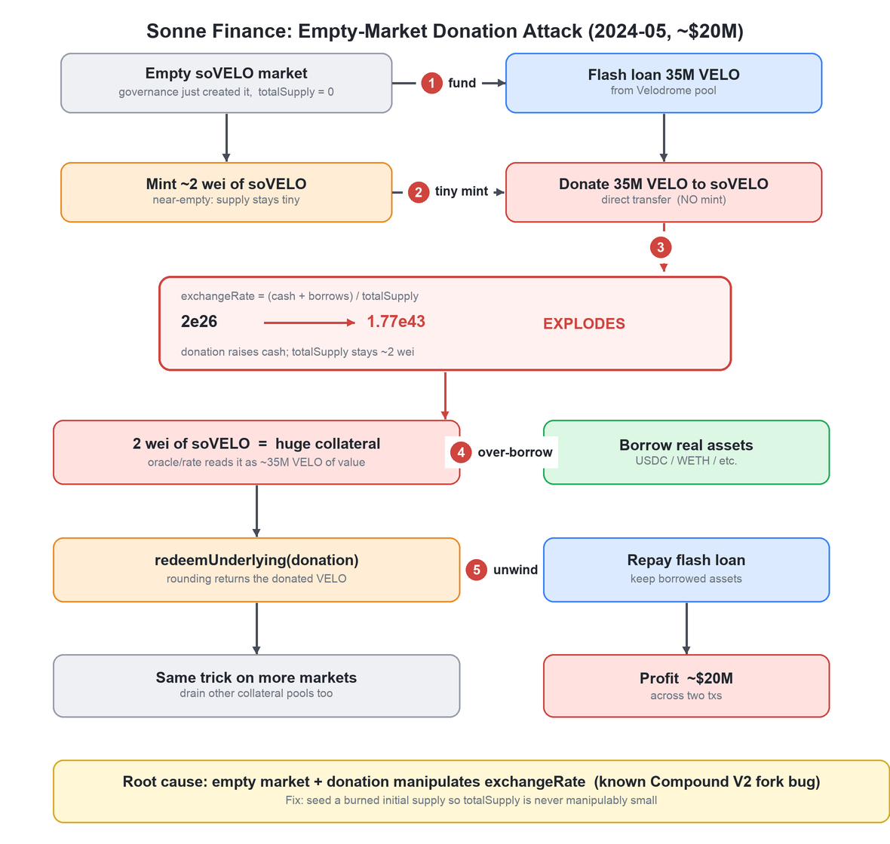
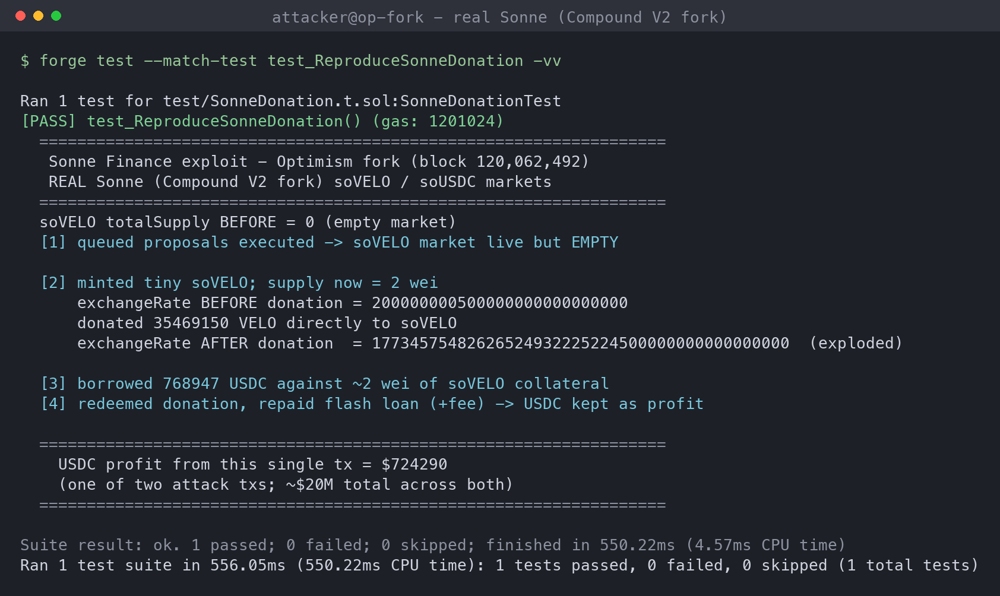
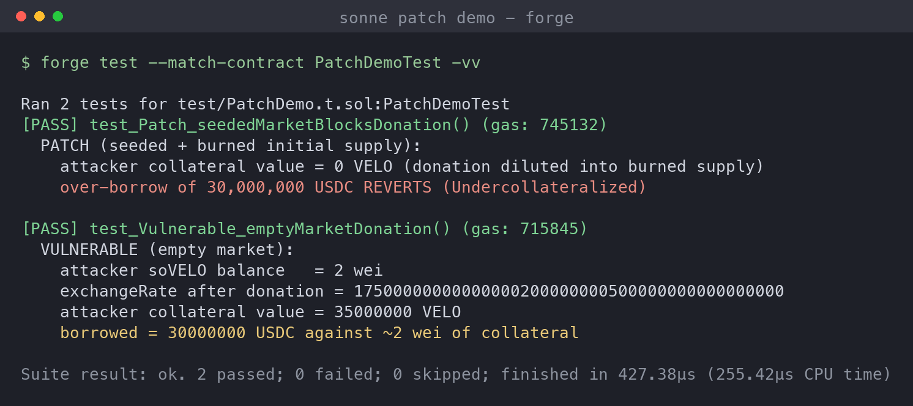

# Sonne Finance: Empty-Market Donation Attack on a Compound V2 Fork

> **Incident summary.** On **2024-05-14** (~22:18 UTC), Sonne Finance, a Compound V2 fork lending protocol on **Optimism**, was drained of **~$20M**. The attacker exploited a **known Compound V2 fork bug**: a newly created cToken market (`soVELO`) had `totalSupply = 0`, so **donating** underlying tokens (a direct transfer, no mint) with a tiny supply made the market's **exchange rate explode**, letting ~2 wei of collateral borrow millions in real assets. This is the same "empty market" / precision-loss class first seen in the **Hundred Finance** hack (April 2023), which Sonne never mitigated. A whitehat (`@tonyke_bot`) later protected the remaining ~$6.5M with about $100 by pre-empting the empty markets. Attacker EOAs `0x5d0d…0bbb` and `0xae4a…1f43`.

## Background

Compound V2 (and its forks) represent each lending market as a **cToken** (here `soVELO`, `soUSDC`). Depositing underlying **mints** cTokens; the cToken-to-underlying price is the **exchange rate**:

```
exchangeRate = (totalCash + totalBorrows - totalReserves) / totalSupply
```

where `totalCash` is the underlying the market physically holds. Your collateral value is `cTokenBalance * exchangeRate`.

The danger lives in that formula when a market is **empty or near-empty** (`totalSupply` tiny):

- `totalCash` can be increased by anyone via a **plain ERC20 transfer** ("donation") straight to the cToken, with **no mint**, so `totalSupply` does not move.
- With `totalSupply` at a few wei, a large donation makes `exchangeRate` enormous. Now a couple of wei of cToken is valued as a huge amount of underlying, so it can be used as collateral to borrow far more than was ever deposited.

This is a **well-documented Compound V2 fork vulnerability**. The standard mitigation is to **seed a burned initial supply** at market creation so `totalSupply` can never be manipulated down to a few wei. Sonne launched the new `soVELO` market without that protection.

## Attack Flow



1. **Empty market.** A governance proposal creating the `soVELO` market had just been queued/executed, leaving a live market with `totalSupply = 0`. The attacker triggers the queued proposals.
2. **Flash loan.** The attacker flash-loans **35,469,150 VELO** from a Velodrome pool for ammunition.
3. **Tiny mint.** They `mint` a minimal amount, receiving only **~2 wei** of soVELO (the market is near-empty).
4. **Donation.** They **transfer all 35M VELO directly** into the soVELO contract (no mint). `totalCash` jumps while `totalSupply` stays ~2 wei, so `exchangeRate` explodes from **2e26 to ~1.77e43**.
5. **Over-borrow.** The ~2 wei of soVELO now reads as ~35M VELO of collateral, so they `borrow` real assets (USDC and others) from Sonne's other markets.
6. **Unwind.** They `redeemUnderlying` the donated VELO back out (rounding lets nearly all of it return while burning ~0 soVELO), repay the flash loan, and keep the borrowed assets. Repeated across markets, this summed to ~$20M.

The core trick: no price oracle was even hacked. The **internal exchange rate**, computed from a manipulable balance over a tiny supply, was the price, and a donation moved it at will.

## The Problem (Root Cause)

**A near-empty cToken market lets a donation manipulate the exchange rate, because the rate divides a manipulable cash balance by a tiny total supply.**

- **Empty market on launch.** The new `soVELO` market went live with `totalSupply = 0` and no burned seed. That is the precondition for the whole attack.
- **Donation moves `totalCash` without minting.** `exchangeRate` reads `underlying.balanceOf(cToken)`, which anyone can inflate with a direct transfer that never touches `totalSupply`.
- **Precision / rounding in redeem.** With an astronomically large exchange rate, redeeming nearly all the donated underlying burns ~0 cTokens (integer division rounds down), so the attacker recovers the donation while keeping the inflated collateral.
- **Known, unpatched bug.** This exact pattern drained Hundred Finance in 2023. The mitigation (seed-and-burn initial supply) was public; Sonne's new market did not apply it.

In short: the exchange rate is a price, and Sonne let an attacker set that price by donating into an empty market.

## Local Reproduction: Optimism-Fork Backtest

This is a deterministic on-chain bug, so it is fully replayable. The PoC runs the **actual exploit against the real deployed Sonne contracts** on an Optimism mainnet fork at **block 120,062,492** (one before the first attack transaction). Exploit logic adapted from the DeFiHackLabs PoC.



The reproduction, all against real contracts:

- Confirms `soVELO.totalSupply = 0` (empty market), then executes the queued governance proposals that make the market live.
- Flash-loans 35,469,150 VELO from the **real Velodrome pool**, mints ~2 wei of soVELO, and **donates** the VELO directly to soVELO.
- Reads the **real exchange rate exploding from `2e26` to `1.77e43`**, borrows against ~2 wei of collateral, redeems the donation, and repays the loan.

Result of the reproduced transaction: **$724,290 USDC** extracted in a single transaction (one of two attack transactions that summed to ~$20M). Test: [`sonne-poc/test/SonneDonation.t.sol`](sonne-poc/test/SonneDonation.t.sol).

## Patch / Remediation

### 1. Seed and burn an initial supply at market creation (the primary fix)
When a cToken market is created, mint a non-trivial amount of cTokens against real underlying and send them to a dead address. `totalSupply` is then never manipulably small, so a donation only dilutes into the burned (unredeemable) share instead of inflating a lone attacker's position. This is the canonical fix Compound Labs uses and the one Sonne lacked.

### 2. Do not let markets be borrowable while empty
Gate a new market's collateral usage (or set its collateral factor to 0) until it holds a meaningful, non-manipulable supply. An empty market should never be usable as collateral.

### 3. Harden the exchange-rate / accounting
Track internal cash from actual mints/redeems rather than reading `token.balanceOf(this)` directly, so a raw donation cannot move the exchange rate. Where balances are read, account for the donation-attack surface explicitly.

### 4. Apply known-vulnerability checklists to forks
Sonne inherited a documented, previously-exploited bug. Forking a codebase inherits its known issues; every fork should be checked against the original protocol's post-incident mitigations before launch.

**Priority order:** (1) seed-and-burn removes the precondition and closes the actual hole; (2) empty-market gating is defense-in-depth; (3)-(4) harden accounting and process so the next fork does not reintroduce it.

### Verifying the patch

On a self-contained MiniCToken that mirrors Compound's exchange-rate math, I ran the same donation against the vulnerable and patched market setups:



- **Vulnerable (empty market):** 2 wei of soVELO, exchange rate explodes after the donation, collateral value reads as **35,000,000 VELO**, and the attacker borrows **30,000,000 USDC** against ~2 wei.
- **Patched (seeded + burned initial supply):** the same donation now dilutes into the burned supply, so the attacker's collateral value is **~0**, and the over-borrow reverts (`Undercollateralized`).

The single seed-and-burn step reduces the attacker's manipulated collateral from ~35M to ~0. Code: [`sonne-poc/src/SonnePatch.sol`](sonne-poc/src/SonnePatch.sol), [`sonne-poc/test/PatchDemo.t.sol`](sonne-poc/test/PatchDemo.t.sol).

## Takeaways

- **An internal exchange rate is a price, and prices must not be manipulable.** No external oracle was compromised; the cToken's own `cash / supply` rate was the price, and a donation moved it. Any value derived from a live token balance over a small denominator is an attack surface.
- **Empty markets are dangerous.** The whole exploit needs `totalSupply ~ 0`. Seeding and burning an initial supply, one line at deployment, removes the precondition entirely.
- **Forks inherit bugs, including the famous ones.** This was a re-run of Hundred Finance (2023). Copying a codebase copies its known vulnerabilities; forks must re-apply the upstream's post-mortem fixes.
- The fix is cheap and the failure was expensive: a seeded, burned initial supply would have turned a $20M drain into a reverted transaction, as the patch demo shows.

## References

- [Verichains: Compound V2 Forked Vulnerability, $20M Sonne Finance Hack](https://blog.verichains.io/p/compound-v2-forked-vulnerability)
- [Halborn: Explained, The Sonne Finance Hack (May 2024)](https://www.halborn.com/blog/post/explained-the-sonne-finance-hack-may-2024)
- [CertiK: Sonne Finance Incident Analysis](https://www.certik.com/resources/blog/sonne-finance-incident-analysis)
- [Coinmonks / Nefture: Tracing the $20M Sonne Finance Exploit](https://medium.com/coinmonks/sonne-finance-exploit-tracing-the-20-million-lost-to-the-hack-79140bbc3e7d)
- [The Block: Sonne Finance faces $20M exploit, pauses markets on Optimism](https://www.theblock.co/post/294508/lending-protocol-sonne-finance-faces-20-million-exploit-pauses-markets-on-optimism)
- [DeFiHackLabs PoC (Sonne_exp.sol)](https://github.com/SunWeb3Sec/DeFiHackLabs)
- Reproduction PoC: [`sonne-poc/`](sonne-poc/) (Foundry; Optimism fork @ block 120,062,492)
