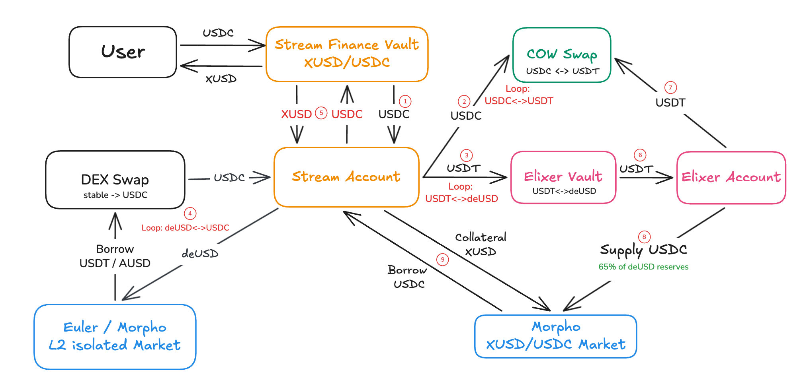
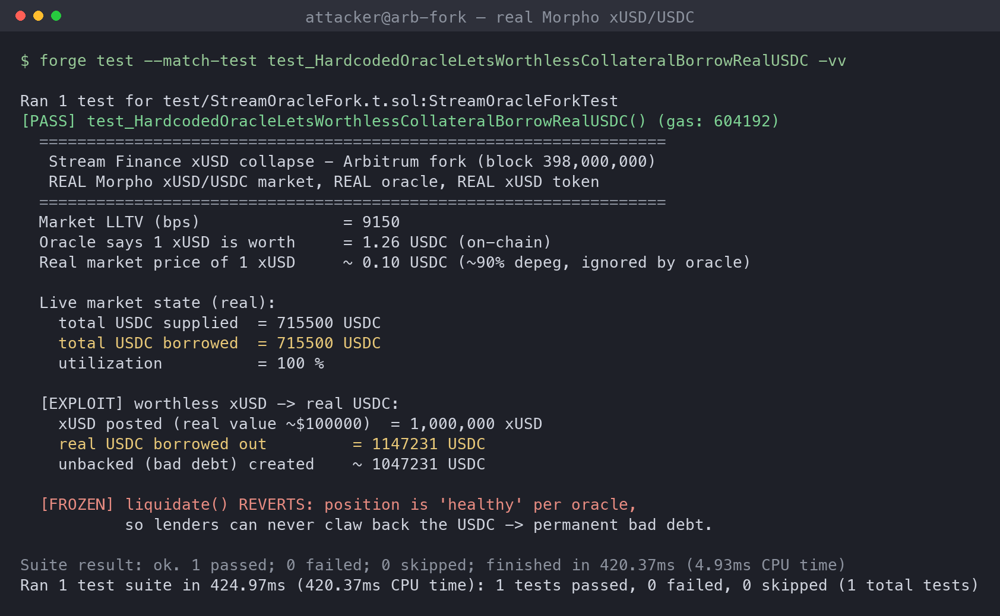
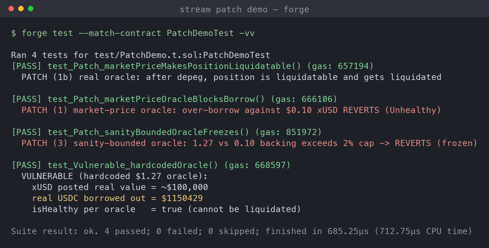

# Stream Finance (xUSD): Recursive-Looping Insolvency and Oracle-Frozen Bad Debt

> **Incident summary.** On **2025-11-03/04**, Stream Finance disclosed that an **external fund manager lost ~$93M** of platform assets (widely linked to the Oct 30 Balancer exploit), then **froze all withdrawals**. Its yield token **xUSD depegged from $1 to ~$0.10–0.26** (77%+, over 90% at the lows), wiping ~$500M of market cap and freezing ~$160M of deposits. DeFi researchers (Yields And More) put the interconnected debt exposure at **~$285M**. The contagion spread through **Elixir's deUSD** (65% of its backing was a loan to Stream via a private Morpho vault; deUSD fell ~98% to ~$0.015 and was later sunset) and into **Morpho, Euler, and Silo**. A structural amplifier ran underneath: Stream and Elixir **recursively minted each other's tokens** to inflate TVL (roughly $1.9M of real USDC bootstrapped ~$14.5M of xUSD), leaving **under $0.10 of real backing per $1**. Lending markets that priced xUSD at a fixed ~$1 could not liquidate the underwater positions, so lenders were left holding the bad debt.

## Background

Stream Finance issued **xUSD**, a yield-bearing "stablecoin" whose returns came from opaque, largely off-chain strategies run by external managers. Users deposited USDC and received xUSD (a vault share that accrued value, quoted near ~$1.27 by the time of the collapse).

The problem is what sat behind that share. Rather than holding liquid reserves, the system was wound into a **recursive loop** with Elixir's **deUSD**:

- Stream's account took USDC, swapped it toward USDT and Elixir's deUSD, and used borrowed assets to mint more xUSD.
- Elixir, in turn, supplied USDC into a **private Morpho vault in which Stream was the only borrower**, borrowing against Stream's own xUSD collateral.
- Each token propped up the other's apparent backing, so headline TVL grew while real collateral did not.

Both legs ultimately depended on lending markets (Morpho, Euler, Silo) that accepted xUSD (and deUSD) as collateral at a **price that was effectively hardcoded near par**. As long as nobody tested redemption, the loop looked solvent. When the external manager's ~$93M loss surfaced, redemption was tested, and the whole structure unwound at once.

---

## Attack Flow

The numbered path in the diagram is the leverage loop, not a single exploit transaction:

1. **User → Stream Finance Vault, and Vault → Stream Account (USDC).** User deposits USDC for xUSD; the vault forwards USDC to the operating "Stream Account".
2. **Stream Account → CoW Swap (USDC ↔ USDT loop).** Real USDC is rotated into USDT to feed the next leg.
3. **Stream Account → Elixir Vault (USDT ↔ deUSD loop).** USDT is used to mint Elixir's deUSD, tying Stream's backing to Elixir's token.
4. **deUSD → DEX Swap / Euler · Morpho L2 isolated market (deUSD ↔ USDC loop; borrow USDT/AUSD).** deUSD is swapped and levered in isolated markets, borrowing more stablecoins to recycle.
5. **Back to xUSD.** The recycled proceeds mint more xUSD, inflating xUSD supply and apparent TVL. Roughly $1.9M of seed USDC bootstrapped ~$14.5M of xUSD this way.
6. **Elixir Vault → Elixir Account (USDT).** Elixir's side of the loop moves USDT to its own account.
7. **Elixir Account → CoW Swap (USDT).** Elixir rotates assets similarly.
8. **Elixir Account → Morpho (Supply USDC): 65% of deUSD reserves.** Elixir supplies USDC into the private Morpho vault where Stream borrows, so most of deUSD's backing becomes a Stream loan (~$68M).
9. **Stream Account ↔ Morpho xUSD/USDC market (collateral xUSD, borrow USDC).** Stream posts its own xUSD as collateral and borrows real USDC. This is where synthetic collateral is finally converted into other people's real stablecoins.

The economic trick: no single step is theft; the loop manufactures collateral out of itself, and step 9 cashes fictitious collateral into real, liquid USDC. When xUSD's real value collapsed, the borrowed USDC was already gone and the collateral backing it was worth cents.

---

## The Problem (Root Cause)

**A fixed, redemption-blind oracle turned a solvency failure into permanent, unliquidatable bad debt, and recursive looping made the shortfall system-wide.**

- **Hardcoded collateral price.** The xUSD/USDC lending markets valued xUSD at a fixed ~$1.27 (its accrued nominal value), not its market or redeemable value. When xUSD fell to ~$0.10, the oracle kept reporting ~$1.27, so Morpho still considered every xUSD-backed loan healthy.
- **Liquidations could never trigger.** Because health is computed from the oracle, underwater positions stayed "healthy" forever. No liquidator could seize collateral, and borrowers had no reason to repay. The lenders' USDC simply froze as bad debt.
- **Fictitious backing via recursion.** Stream and Elixir minted each other's tokens in a loop, so headline collateral was mostly claims on the counterparty's synthetic token, not real assets (under $0.10 real per $1).
- **Self-referential, curator-captured markets.** Elixir's private Morpho vault had Stream as its only borrower against Stream's own token. There was no independent risk boundary; one counterparty's failure was total.
- **Opaque off-chain risk.** The actual assets were managed off-chain by an external manager whose ~$93M loss (tied to the Balancer hack) was invisible on-chain until withdrawals were frozen.
- **Composability spread it.** Because xUSD and deUSD were accepted across Morpho, Euler, and Silo, the shortfall propagated into every venue that had trusted the fixed price.

In short: the collateral was worth a fraction of its on-chain price, and the oracle guaranteed the market would never notice.

---

## Local Reproduction: Arbitrum-Fork Backtest

To ground the analysis I reproduced the core defect on an **Arbitrum mainnet fork pinned to block 398,000,000 (2025-11-08, days after the collapse)**, against the **real Morpho Blue market**, the **real xUSD token**, and the **real price oracle** (market id `0x9e90…7709`, oracle `0x1837…06DA`, LLTV 91.5%).

What the fork shows, all from live contract state:

- **The oracle ignores the depeg.** `oracle.price()` returns a fixed ~$1.27 valuation for xUSD. Reading it across blocks (Sep 2025 → 2026) it never moves with the market: it sat at ~$1.24 before the collapse, crept to ~$1.27, and froze there, while xUSD traded near $0.10. The oracle is redemption-blind by construction.
- **The bad debt is real and frozen.** At the fork block the market shows **715,500 USDC supplied = 715,500 USDC borrowed = 100% utilization**: every supplied dollar is borrowed out against xUSD collateral, so lenders cannot withdraw a cent. (The same market later grew to ~$2.57M, still fully utilized.)
- **Worthless collateral still borrows real USDC.** Posting **1,000,000 xUSD (real value ~$100k at $0.10)** as collateral lets an account borrow **~1,147,231 USDC** at the 91.5% LLTV, because Morpho values that xUSD at ~$1.27. That is **~$1.05M of unbacked debt created in one transaction**.
- **The position cannot be liquidated.** `liquidate()` reverts: per the oracle the position is healthy, so there is no way to claw the USDC back. This is exactly why lenders were stuck.

Test: [`stream-poc/test/StreamOracleFork.t.sol`](stream-poc/test/StreamOracleFork.t.sol).

---

## Patch / Remediation

### 1. Price collateral by its real/redeemable value, never a hardcoded par
The single change that closes the hole: the xUSD/USDC market must use an oracle that reflects xUSD's **market price or its actual redemption/backing rate**, not a fixed ~$1.27. With a truthful price, over-borrowing against depegged xUSD is rejected and existing positions become liquidatable the moment backing falls.

### 2. Sanity-bound the oracle with a circuit breaker
If a nominal/accrual price is used, gate it against an independent backing or redemption feed and **revert when the two diverge beyond a cap** (e.g. 2%). A market that freezes on divergence stops minting new bad debt instead of silently absorbing it.

### 3. Proof-of-reserves / backing verification before accepting a token at par
Do not treat a yield-bearing token as ~$1 of collateral without on-chain evidence of redeemable backing. Pair this with **conservative supply caps and isolation** so a single synthetic collateral cannot become a whole market's solvency.

### 4. No self-referential, single-borrower markets
A curated market whose only borrower posts its own token (Stream in Elixir's private Morpho vault) has no independent risk boundary. Curators should enforce borrower diversity and reject collateral that is a claim on the borrower itself.

### 5. Transparency on off-chain managers and withdrawals
Opaque external managers and the ability to freeze withdrawals hid the ~$93M loss until it was too late. Publish reserve attestations and constrain unilateral withdrawal pauses.

**Priority order:** (1) a truthful oracle closes the actual hole; (2)–(3) are containment if a nominal price is ever used; (4)–(5) remove the structural setup that made the loss total.

### Verifying the patch

On a self-contained MiniLend market that mirrors Morpho's oracle-driven health logic, I drove the *same worthless-collateral scenario* through the vulnerable and patched oracle designs:

- **Vulnerable (hardcoded $1.27):** ~$100k of real xUSD value borrows **~$1.15M** real USDC and the position reads healthy, so it can never be liquidated.
- **Patch (1) market-price oracle:** the same over-borrow against $0.10 xUSD reverts (`Unhealthy`).
- **Patch (1b) market-price oracle:** a position opened before the depeg becomes liquidatable the instant the oracle tells the truth, and is liquidated (the opposite of the frozen real market).
- **Patch (3) sanity-bounded oracle:** a $1.27 nominal price that diverges from a $0.10 backing feed beyond the 2% cap reverts (`OracleDeviation`), freezing the market safely.

Any one control breaks the bad-debt machine. Code: [`stream-poc/src/StreamPatch.sol`](stream-poc/src/StreamPatch.sol), [`stream-poc/test/PatchDemo.t.sol`](stream-poc/test/PatchDemo.t.sol).

---

## Takeaways

- The oracle was the single point of failure. A collateral price hardcoded near par converts any depeg into **silent, unliquidatable bad debt**: the market never even flags the loss. This is the on-chain crux, still visible as a 100%-utilized, frozen market.
- **Yield is not backing.** Recursive looping between Stream and Elixir manufactured TVL out of each other's tokens; under $0.10 of real assets stood behind each $1. Composability then exported the shortfall to Morpho, Euler, and Silo.
- **Self-referential markets are a red flag.** A private vault whose sole borrower posts its own token has no independent risk boundary, so a single counterparty's failure is complete.
- Truthful/redemption-aware oracles, deviation circuit breakers, proof-of-reserves, supply caps, and borrower diversity are individually cheap. As the patch demo shows, any one of them would have turned a $285M contagion into a contained, liquidatable loss.

---

## References

- [BlockEden: Anatomy of a $285M DeFi Contagion (the Stream Finance xUSD Collapse)](https://blockeden.xyz/blog/2025/11/08/m-defi-contagion/)
- [Rekt: The Loop Contagion](https://rekt.news/loop-contagion)
- [The Defiant: How Stream Finance's Collapse Exposed DeFi's Looping Yield Bubble](https://thedefiant.io/news/defi/how-stream-finance-s-collapse-exposed-defi-s-looping-yield-bubble)
- [CCN: Why xUSD Depegged, Stream Finance Stablecoin Crisis Explained](https://www.ccn.com/education/crypto/why-xusd-depegged-stream-finance-stablecoin-crisis-explained/)
- [Tekedia: Elixir Sunsets deUSD After Fallout on Stream Finance](https://www.tekedia.com/elixir-sunsets-deusd-after-fallout-on-stream-finance/)
- [Morpho Docs: Oracles](https://docs.morpho.org/learn/concepts/oracle/)
- Reproduction PoC: [`stream-poc/`](stream-poc/) (Foundry; Arbitrum fork @ block 398,000,000)
