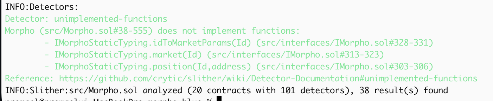
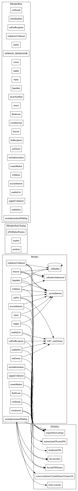

# Morpho Blue V1: Slither Static Analysis

## Background

Morpho Blue is a singleton lending protocol. Unlike Compound or Aave, there's no governance-controlled risk parameter; market creators set their own oracle, LTV, and liquidation incentive at deployment time. This makes the codebase unusually lean (~676 SLOC across 20 contracts), which is part of why I chose it to practice static analysis.

I ran Slither as part of verifying Morpho's DeFiScan v2 security score. The goal wasn't to find zero-days (Morpho has been through multiple audits), but to get a feel for what Slither catches on a well-audited DeFi codebase versus what it misses or flags as noise.

---

## Setup

```bash
git clone https://github.com/morpho-org/morpho-blue
cd morpho-blue
forge install
pip install slither-analyzer --break-system-packages
```

Slither needs the compiled artifacts, so I ran a `forge build` first before pointing it at the source.

---

## Commands Run

### 1. Full detector sweep

```bash
slither src/Morpho.sol --detect all
```

This is always my starting point. The output is noisy but gives a complete picture before I start filtering.



**Summary output:**

```
INFO:Slither:src/Morpho.sol analyzed (20 contracts with 101 detectors), 38 result(s) found
```

38 results across all severity levels. Broken down below.

### 2. Function visibility

```bash
slither src/Morpho.sol --print function-summary
```

Mapping which functions are external vs. public vs. internal before digging into findings. A few things stood out from the actual output.

All user-facing entry points are external (not public): supply, withdraw, borrow, repay, supplyCollateral, withdrawCollateral, liquidate, flashLoan, accrueInterest. No unexpected public functions on the main contract.

The 5 admin functions (setOwner, enableIrm, enableLltv, setFee, setFeeRecipient) all go through the onlyOwner modifier. _accrueInterest and _isHealthy are internal, called by the relevant external functions.

One observation worth noting: supplyCollateral does not call _accrueInterest, unlike supply, withdraw, borrow, repay, and withdrawCollateral. This makes sense structurally since supplying collateral doesn't affect the interest-bearing pool, but it means the market's interest state isn't updated on collateral deposits. Not a bug, just a design choice worth being aware of.

liquidate has the highest cyclomatic complexity (4) among all functions, reflecting the conditional bad debt handling logic. The other state-changing functions sit at 1-3. extSloads and the view-only getters are at 2 (Slither's baseline for functions with return values).

### 3. Data dependency

```bash
slither src/Morpho.sol --print data-dependency
```

This traces which state variables feed into which computations. Useful for spotting oracle dependency chains. In Morpho's case, the oracle price feeds directly into `_isHealthy()`, which gates borrow and liquidation logic. Nothing surprising here, but it helped me map the trust boundary visually.

### 4. Call graph

```bash
slither src/Morpho.sol --print call-graph
```



Generated `morpho.call-graph.dot`. Morpho's callback pattern (external contracts called mid-execution during flash loans and liquidations) shows up clearly here. This is the main reentrancy surface.

### 5. External-function detector

```bash
slither src/Morpho.sol --detect external-function
```

Flags internal functions that could be marked `external` instead of `public` for gas savings. Got 4 hits, all in view functions used for off-chain reads. Not a security issue.

---

## Findings Breakdown

### Medium (13 total)

Most of the medium findings fell into two categories:

**`reentrancy-benign` (8 findings)**

Slither flagged every state update that happens before or after an external call. In Morpho this is mostly the flash loan and liquidation callback pattern; the contract calls out to the borrower/liquidator mid-transaction, then resumes.

Example (simplified):
```
Morpho.flashLoan() calls out to IFlashLoanReceiver.onFlashLoan()
→ state variable `totalBorrow` is read/written across this boundary
→ Slither: reentrancy-benign
```

These are labeled "benign" because Slither's taint analysis determined the re-entry path doesn't lead to a different execution outcome. But I cross-referenced each one against the audit reports from a16z and Spearbit. They all note that Morpho's single-slot storage and checks-effects-interactions ordering are intentional design choices that make these safe. The findings are technically accurate but not exploitable in context.

**`divide-before-multiply` (3 findings)**

Interest accrual math. Morpho uses `mulDivDown` and `mulDivUp` from the `MathLib` throughout. Slither picks these up as potential precision loss because it doesn't understand the custom fixed-point library; it just sees a division followed by a multiplication in the raw AST.

```solidity
// example pattern Slither flags
uint256 interest = assets.mulDivDown(rate, WAD);
```

After reading `MathLib.sol`, these are fine. The library rounds down/up explicitly to avoid truncation issues. False positive.

**`arbitrary-send-eth` (2 findings)**

Morpho doesn't hold native ETH (it wraps to WETH at the periphery), but Slither still flagged two low-level call paths in the periphery contracts. Worth a manual look; turned out to be the `unwrapETH` helper that's intentionally transferring ETH to the caller.

---

### Low (11 total)

| Detector | Count | Notes |
|---|---|---|
| `missing-zero-check` | 4 | Address params in market creation. Morpho intentionally omits these; invalid markets just fail at runtime |
| `calls-loop` | 3 | Batch operation helpers in periphery |
| `variable-shadowing` | 2 | Local `id` variable shadows a storage struct field in two functions |
| `tautology` | 2 | Boundary checks that are always true given upstream invariants |

The `variable-shadowing` ones are worth noting. Not exploitable, but the kind of thing that could cause confusion in a code review:

```solidity
// simplified
function _accrueInterest(Id id, ...) {
    MarketParams memory id = ...  // shadows the parameter
```

Logged this as a style issue rather than a vulnerability.

---

### Informational (14 total)

Mostly dead code in test helpers, assembly usage notes, and ABI encoder v2 warnings that don't apply to Solidity 0.8+. Skipped these.

---

## What Slither Missed

This is the more interesting part.

**1. Oracle price staleness**  
Morpho trusts whatever oracle the market creator passes in. If a market is created with a poorly configured oracle that doesn't validate `updatedAt`, the protocol happily accepts stale prices. Slither has no way to know this; it sees a function call to `IOracle.price()` and can't evaluate whether that oracle has freshness checks or not.

**2. Market parameter griefing**  
A subtle issue: anyone can create a market with `lltv = 0`, which is technically valid but makes the market unusable. Not a vulnerability in the traditional sense, but a griefing vector that doesn't show up in static analysis.

**3. ERC-4626 vault rounding**  
MetaMorpho (the vault layer) has rounding behavior that Slither doesn't flag because it's not looking at economic correctness, just code patterns. The rounding in share/asset conversions slightly favors the vault over depositors, which is intentional (per the whitepaper) but wouldn't be caught by any static tool.

---

## Takeaways

Running Slither on Morpho felt like auditing a codebase that's already been through serious review; the signal-to-noise ratio was low, which is actually a good sign for the protocol. Most findings were either false positives from the custom math library or reentrancy patterns that are structurally safe.

The more useful output was `--print call-graph` and `--print data-dependency`. Those two printers gave me a map of the execution flow and trust boundaries that made the manual review much faster afterward.

If I were doing this for a less-audited protocol, the `reentrancy-eth` and `arbitrary-send-eth` detectors would be the first things I'd chase down manually before anything else.

---

## References

- [Morpho Blue repository](https://github.com/morpho-org/morpho-blue)
- [Morpho Blue Whitepaper](https://whitepaper.morpho.org)
- [Spearbit audit report](https://github.com/morpho-org/morpho-blue/blob/main/audits)
- [DeFiScan Morpho Blue report](https://defiscan.info)
- [Slither documentation](https://github.com/crytic/slither)