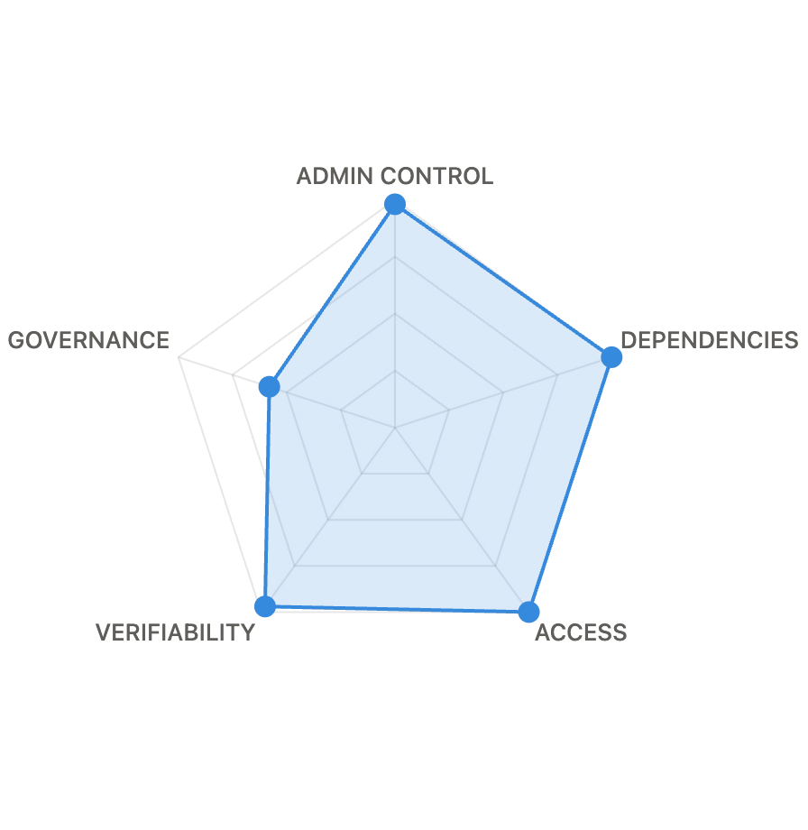
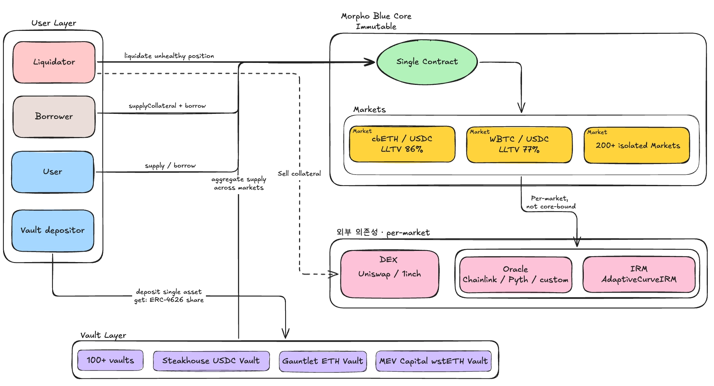

# Morpho Blue

**`VERIFIED`** · **Morpho Blue** · Lending · Ethereum

> Morpho Blue is Morpho Blue's non-custodial, immutable lending primitive, operating on Ethereum mainnet.
>
> The protocol is implemented as a single non-upgradeable singleton contract, within which independent lending markets operate. Each market is defined by a combination of the following 5 elements:
>
> - Loan token (loanToken)
> - Collateral token (collateralToken)
> - Oracle (oracle)
> - Interest rate model (IRM)
> - Liquidation loan-to-value (LLTV)
>
> Anyone can permissionlessly create new markets within the range of IRM and LLTV options whitelisted by governance.
>
> Borrowers can deposit collateral and take out loans based on a fixed liquidation loan-to-value ratio (LLTV). In addition, price oracles and interest rate models are configured individually per market, rather than applied protocol-wide.
>
> Owner privileges are limited to the following 5 functions:
>
> - `setOwner`
> - `enableIrm`
> - `enableLltv`
> - `setFee`
> - `setFeeRecipient`
>
> With these privileges, the owner:
>
> - cannot move user funds,
> - cannot pause markets,
> - cannot change the configuration of existing markets,
> - and cannot upgrade the contract.
>
> The owner privileges are currently held by a 5-of-9 Gnosis Safe multisig wallet, with off-chain Snapshot voting (`morpho.eth`) serving as an advisory governance layer.
>
> TVS (Total Value Secured) is **$5.08B** on Ethereum mainnet, based on:
>
> - TVL of $3.95B
> - Morpho market cap of $1.12B

### Risk Radar

| Axis | Score (0–100) |
| --- | --- |
| **ADMIN CONTROL** | **98** |
| **DEPENDENCIES** | **100** |
| **ACCESS** | **100** |
| **VERIFIABILITY** | **97** |
| **GOVERNANCE** | **58** |

---

## Key Findings

> **0 EOAs with privileged access**
>
> Morpho.owner is a 5-of-9 Safe (MorphoOwnerSafe, `0xcBa28b…4f9AFa`), and there is no path for an EOA to directly call the 5 onlyOwner functions of Morpho.sol (`enableIrm`/`enableLltv`/`setFee`/`setFeeRecipient`/`setOwner`). `feeRecipient` is also `0x0`, so no fees are currently collected.

> **1 multisig with privileged access**
>
> MorphoOwnerSafe (5-of-9) solely holds all onlyOwner functions of Morpho.sol. If the URD is included in scope, OperatorSafe (3-of-7) adds one more, making 2 multisigs. Whether the 9 and 7 signer lists intersect can only be confirmed by comparing the `$members` of the two Safes.

> **Immutable code**
>
> Morpho.sol, AdaptiveCurveIrm, MetaMorphoV1_1Factory, MorphoChainlinkOracleV2Factory, EthereumBundlerV2, PreLiquidationFactory, UrdFactory, UniversalRewardsDistributor, PublicAllocator, and Wrapper are all deployed with `$immutable = true` — no upgrade functions. Even the multisig cannot change the code itself, only adjust parameters. (The MORPHO token proxy is separate — it has a history of 1 upgrade, and is separated from the lending core.)

> **$&lt;TVS&gt; TVS**
>
> The sum of the collateral and loan token balances held per market by Morpho.sol plus the Morpho market cap. The exact USD value is computed at `funds-data.json`/oracle price compile time. Morpho Blue's Ethereum TVL is in the multi-billion-dollar range per public dashboards.

> **0 external dependencies (core)**
>
> The Morpho.sol core has 0 permanently coupled external contracts. The target addresses of all external calls (`IIrm.borrowRate`, `IOracle.price`, `IERC20.safeTransfer`) come from calldata (`marketParams`, `token`) or `msg.sender` (callback) — no storage coupling. `detectDependencies` triggers `Fully autonomous protocol`.

> **Only 3 functions have mitigations; all core onlyOwner functions execute immediately**
>
> `setFee` ≤ `MAX_FEE = 0.25e18` (25%), `enableLltv` < `WAD = 1e18` (100%) — valueRange enforced by `require`. URD `setRoot` has a 5-day (432000s) timelock. The remaining `enableIrm`/`setOwner`/`setFeeRecipient` execute immediately with no delay, no timelock.

## Total Value Secured (TVS)

### TOTAL TVS

# $5.08B

### CONTRACTS HOLDING TVS: 1

| Contract | Address | TVS ▾ |
| --- | --- | --- |
| **Morpho Blue** (Singleton) | `0xBBBB…FFCb` | `TVL` **$3.95B** |
| **MORPHO Token** | `0x58d9…92b2` | `MORPHO` **$1.12B** |

---

## Source Code

### Source Code Verification

| Number of contracts | **1 Contract** (Morpho Blue, single contract — `0xBBBBBbbBBb9cC5e90e3b3Af64bdAF62C37EEFFCb`) |
| --- | --- |
| Lines of Code | **1,732 LoC** |
| Coverage | **100%** |

### Audits & Bug Bounties

| Stat | Value |
| --- | --- |
| security audits | **3** |
| Bug Bounty | **$2.5M** |

### Audit Reports

| Date | Author | Scope |
| --- | --- | --- |
| 2023-10-13 | **OpenZeppelin** | Morpho Blue and Speed Jump IRM |
| 2023-11-13 | **Cantina** | Managed Review |
| 2024-01-05 | **Cantina** | Competition |

### Licensing

| License | Scope |
| --- | --- |
| **GPL-2.0-or-later** | Entire repository |
| (legacy) BUSL-1.1 | License before the 2024 GPL transition — preserved in commit hashes |

### VERIFIABILITY

### SCORE

# 97 / 100

*VERIFIABILITY = weighted sum of source coverage + number of audits + LoC + bug bounty (max 100)*

| Component | Weight | Tier | Score |
| --- | --- | --- | --- |
| Source coverage | 50 | `100% → 50` | **50** |
| Number of audits | 25 | `3 → 22` | **22** |
| LoC (inverse weight) | 15 | `≤5k → 15` | **15** |
| Bug bounty | 10 | `≥$1M → 10` | **10** |

#### Component Details

- **Source coverage (weight 50)** — Ratio of Etherscan-verified contracts among non-EOA contracts. Morpho Blue's single deployed contract is verified, so 1/1 = **100%** → tier `100% → 50` → **50 points**.
- **Number of audits (weight 25)** — Reports in the Morpho Blue core repository's `audits/` folder = **3** (OpenZeppelin, Cantina Managed Review, Cantina Competition). Tier `3 → 22` → **22 points**.
- **LoC (weight 15, inverse — smaller is better)** — Morpho Blue totals 1,441 lines. Tier `≤5k → 15` → **15 points**. Based on the assumption that a smaller codebase is easier to audit.
- **Bug bounty (weight 10)** — Cantina's maximum critical smart contract reward = **$2.5M**. Tier `≥$1M → 10` → **10 points**.

---

## ADMIN CONTROL

**IMPACTED TVS: ≤ 5%**

**ADMINS DETECTED: 2**

**TOP ADMINS**

| **Admin** | **Type** | **TVS** | **Mitigations** |
| --- | --- | --- | --- |
| MorphoOwnerSafe (5/9) `0xcBa28b38103307Ec8dA98377ffF9816C164f9AFa` | MULTISIG | ≤ 5% ($5.08B) | VALUE-RANGE-BOUND (MAX_FEE = 25%, LLTV < WAD) |
| OperatorSafe (3/7) — URD `setRoot` only | MULTISIG | — | 5-DAY-DELAY (URD `setRoot` timelock = 432000s) |

### MorphoOwnerSafe Permissioned Functions

| Function | Effect | Bound |
| --- | --- | --- |
| `setOwner(address)` | Replace owner | **No 2-step**, zero address possible |
| `enableIrm(address)` | Add IRM to whitelist | **Cannot disable** |
| `enableLltv(uint256)` | Add LLTV to whitelist | **Cannot disable**; `lltv < WAD` (1e18) enforced |
| `setFee(MarketParams, uint256)` | Set market fee | **MAX_FEE = 25%** |
| `setFeeRecipient(address)` | Change fee recipient | Zero address possible. Currently = 0x0. |

### OperatorSafe Permissioned Functions

| Function | Effect | Bound |
| --- | --- | --- |
| `setRoot(bytes32, bytes32)` | Submit new Merkle root to the URD (pending state) | **5-day timelock** (`timelock = 432000s`), root not applied immediately |

### Owner CANNOT

| Action | Verification |
| --- | --- |
| Move user funds | No `onlyOwner` anywhere in `withdraw`/`withdrawCollateral`/`repay`/`liquidate` |
| Pause / Freeze | No `pause` function exists at all |
| Change oracle/IRM/LLTV (existing markets) | Market parameters are recorded only at `createMarket` time; no function to change them afterwards |
| Upgrade the contract | No proxy |
| Change liquidation incentive / cursor | `LIQUIDATION_CURSOR`, `MAX_LIQUIDATION_INCENTIVE_FACTOR` are `constant` |

### Risk Calculation

### SCORE

# 98 / 100

*ADMIN CONTROL = 100 × (1 − riskMultiplier × fundShare). Determined by the share of TVS reachable by the single most dangerous admin.*

| Variable | Value | Rationale |
| --- | --- | --- |
| Risk multiplier (riskMultiplier) | **0.40** | 5-of-9 Safe — `1 − 0.15·(5−1)`, floor 0.35 |
| Fund share (fundShare) | **0.05** | `setFee` can raise market fee to max 25% × only future interest reachable, principal 0 |
| Risk score (product) | **0.02** | 0.40 × 0.05 |
| **Final score** | **98** | 100 × (1 − 0.02) |

#### Component Details

The ADMIN CONTROL score is determined by **"how much TVS can a single worst admin reach."**

- **Risk multiplier (riskMultiplier)** — 1.0 for a single EOA; reduced according to threshold for a multisig. Morpho's owner, as verified on-chain above, is a **5-of-9 Safe**, so 5 keys must be compromised simultaneously to exercise the privilege. In this case the multiplier is **0.40** (`1 − 0.15·(5−1) = 0.40`, above the 0.35 floor).
- **Fund share (fundShare)** — The funds reachable by that admin divided by TVS. None of the owner's 5 functions (`setOwner`/`enableIrm`/`enableLltv`/`setFee`/`setFeeRecipient`) can withdraw or move principal (see the Owner CANNOT table). The only fund impact is that `setFee` can raise a market's fee up to 25%, diverting only **a portion of future interest** to the `feeRecipient` — a single-digit % relative to TVS. Conservatively applied as **0.05**.
- **Risk score = 0.40 × 0.05 = 0.02** → **Score = 100 × (1 − 0.02) = 98**.

The 5-of-9 multisig structure yields a 3-point gain compared to a sole EOA admin (an EOA is applied with a multiplier of 1.0, giving 95 points at the same fundShare).

---

## Governance

### System Overview

### Voting Process

| Implementation | **Snapshot off-chain voting** + **5-of-9 Safe execution** |
| --- | --- |
| Vote Execution | **Off-chain** (Snapshot space `morpho.eth`, network=1) |
| Voting Unit | **MORPHO** (`0x58d97b57bb95320f9a05dc918aef65434969c2b2`) via `morpho-delegation` strategy |
| Proposal Requirements | **500,000 MORPHO** (Snapshot space `filters.minScore`) |

| Voting Period | **3 Days** |
| --- | --- |
| Execution Delay | **0** — Snapshot results are advisory; the 5-of-9 Safe executes immediately (no on-chain timelock contract) |
| Quorum | **500,000 MORPHO** |
| Proposals to date | **137** |

### Voting Power Distribution

### Risk Calculation

### SCORE

# 58 / 100

*GOVERNANCE = weighted sum of vote execution method + total delay + governance fund share (max 100).*

| Component | Weight | Tier |
| --- | --- | --- |
| Vote execution method | 35 | `off-chain → 10` |
| Total delay | 35 | `≥3d → 18` |
| Governance fund share | 30 | `≤10% → 30` |
| **Total** | 100 | 58 |

#### Component Details

The GOVERNANCE score is a weighted sum of three signals:

- **Vote execution method (weight 35)** — 35 for on-chain governance, 10 for off-chain. Per Morpho's official docs (`docs.morpho.org/governance/organization/morpho-dao/`), voting is conducted **off-chain on Snapshot** (space `morpho.eth`), and results are executed manually by the 5-of-9 Safe. Therefore **10 points**.
- **Total delay (weight 35)** — Proposal period + execution delay summed in seconds, then tiered. The Snapshot space's `voting.period = 259,200` (= **3 days**), the space's `voting.delay = null`, and there is no timelock contract between the Safe and Morpho Blue, so execution delay = **0**. A total of 3 days falls in tier `≥3d → 18`, hence **18 points**.
- **Governance fund share (weight 30)** — What fraction of TVS the governance-tagged admin can reach. Here governance is the owner Safe itself, and as seen in ADMIN CONTROL its reachable share is ≤ 5%. Tier `≤10% → 30` → **30 points**.
- **Total = 10 + 18 + 30 = 58**.

From a mitigation perspective: if a one-week timelock contract were introduced between the Safe and Morpho Blue, the total delay would be ≥ 7d, moving the tier up to `28` and the GOVERNANCE score to around **68**. If voteExecution were also switched to an on-chain Governor, the weight-35 component would be added, bringing it to around **83**.

---

## Dependencies

### Top Dependencies

**0 external dependencies** detected at the core protocol level — 0 of the 5 onlyOwner functions of Morpho.sol call external contracts, and the calldata-driven external calls made by users (`IIrm` / `IOracle` / `IERC20` / `SafeTransferLib`) are separated from the admin graph, leaving no path for the owner to reach external entities' funds.

We traced the **target address origins** of all 19 outbound calls made by the Morpho core.

| Callee Interface | Method | Call site | Target address origin |
| --- | --- | --- | --- |
| `IIrm` | `borrowRate()` | `createMarket`, `_accrueInterest` | `marketParams.irm` (calldata) |
| `IOracle` | `price()` | `liquidate`, `_isHealthy` | `marketParams.oracle` (calldata) |
| `IERC20` (via `SafeTransferLib`) | `safeTransfer` / `safeTransferFrom` | `supply`/`withdraw`/`borrow`/`repay`/`supplyCollateral`/`withdrawCollateral`/`liquidate` | `marketParams.loanToken` or `marketParams.collateralToken` (calldata) |
| `IERC20` (via `SafeTransferLib`) | `safeTransfer` / `safeTransferFrom` | `flashLoan` | `token` (function argument) |
| `IMorphoSupplyCallback` | `onMorphoSupply` | `supply` | `msg.sender` |
| `IMorphoRepayCallback` | `onMorphoRepay` | `repay` | `msg.sender` |
| `IMorphoSupplyCollateralCallback` | `onMorphoSupplyCollateral` | `supplyCollateral` | `msg.sender` |
| `IMorphoLiquidateCallback` | `onMorphoLiquidate` | `liquidate` | `msg.sender` |
| `IMorphoFlashLoanCallback` | `onMorphoFlashLoan` | `flashLoan` | `msg.sender` |

**Morpho's state variables and their dependency relationships** (address-typed):

| State Variable | Dependency | Used in external calls? |
| --- | --- | --- |
| `owner` | `newOwner` (calldata) | No — used for access control (`onlyOwner`). 0 external calls. |
| `feeRecipient` | `newFeeRecipient` (calldata) | No — target of the fee share credit in `_accrueInterest` (`position[id][feeRecipient]`), 0 external calls. |
| `isIrmEnabled` (mapping) | Itself (write-only by owner) | No — only a *permission* gate via `require(isIrmEnabled[marketParams.irm])`. The IRM address is not called directly. |
| `isLltvEnabled` (mapping) | Same | No — same (LLTV whitelist, uint256 values) |
| `idToMarketParams` (mapping) | Itself + `marketParams` (calldata) | **No** — confirmed by Slither: all external functions receive and use `marketParams` as calldata, and `idToMarketParams[id]` is not used in external calls. Stated in NatSpec L325–L327: *"This mapping is not used in Morpho. It is there to enable reducing the cost associated to calldata on layer 2s by creating a wrapper contract"*. |

### Summary of Results

| Perspective | Dependency count |
| --- | --- |
| **Number of cross-contract calls** | **19** |
| Of which, called via **storage-stored address** | **0** |
| Of which, called via **calldata input (`marketParams`, `token`)** | **14** |
| Of which, called via **`msg.sender`** | **5** (all callbacks) |
| **Result of applying the dependency definition** | **0** |

Since the addresses of all external contracts the core *calls* are either (a) values passed by the caller via calldata or (b) `msg.sender` itself, no external entity is permanently coupled to the core. At the market level, that market's oracle / IRM / loan token / collateral token are 4 dependencies, but that is the market curator's area of responsibility and is not included in the core protocol-level score.

This is a natural consequence of Morpho Blue's core design philosophy — *"a simple, immutable, and governance-minimized base layer"* — the core protocol serves only as the base layer, and oracle / IRM selection is delegated to each market.

### Impact Stats

| Metric | Value |
| --- | --- |
| **Impacted TVS** | **0%** |
| **Dependencies Detected** | **0** (core protocol level, verified via Slither static analysis) |
| **Cross-contract calls (Slither)** | 19 (all calldata / msg.sender based) |

### Risk Calculation

- For each external entity, compute exposure = `min(1, Σ contract_TVS_share)` and apply the DUST_USD ($1) filter
- If `exposures.length === 0`, immediately return **100**
- Otherwise apply `clamp(0, 100, 100·(1 − 0.65·worst) − 7.5·√tail)` (worst = max exposure, tail = sum of the rest)

Since 0 of the 5 functions callable by Morpho Blue's owner call external addresses, the EnhancedGraph BFS finds 0 admin-reachable external entities. → **100 points** at step 2.

> At the market level, that market's oracle / IRM / loan token / collateral token are dependencies, but those are subject to per-market review, while this score is at the core protocol level.

---

## Frontends / Access

| Frontend | Subtype | URL |
| --- | --- | --- |
| **Morpho App** | official | `https://app.morpho.org/` |
| **Morpho Fallback** | official (IPFS fallback) | `https://fallback.morpho.org/` |
| **DeFi Saver** | third-party | `https://app.defisaver.com/morpho` |
| **Instadapp Pro** | third-party | `https://defi.instadapp.io/morpho` |
| **SummerFi** | third-party | `https://summer.fi/` |
| **Contango** | third-party | `https://contango.xyz/` |
| **Idle** | third-party | `https://idle.finance/` |

### Risk Calculation

The ACCESS score is determined solely by the **number of frontend entries**.

Tiers: `0 → 20`, `1 → 50`, `2–3 → 75`, `4+ → 100`.

The 2 official dApps announced in Morpho's official docs (`app.morpho.org`, `fallback.morpho.org`) plus the 5 third-party integrations Morpho recognizes as official partners (DeFi Saver, Instadapp Pro, SummerFi, Contango, Idle) total **7 ≥ 4 tier** → **100 points**.

---

## ORACLE RISK

### Oracle Architecture

- **Per-market oracle**: freely chosen by the market creator (permissionless)
- **No fallback oracle**: if the single oracle fails, liquidations halt
- **Oracle factory**: MorphoChainlinkOracleV2Factory (whitelisted)

### Common Oracle Providers (based on top markets)

| Oracle | Market share | Reliability | Liveness |
| --- | --- | --- | --- |
| Chainlink | ~70% | High | 1hr heartbeat |
| Pyth | ~15% | Medium-High | Pull-based |
| Custom (RedStone, etc.) | ~10% | Variable | Varies per market |
| LST/LRT exchange rate | ~5% | Asset-dependent | On-chain |

### Ethereum mainnet

- **Scope**: 1,496 markets on Ethereum mainnet / supply TVL **$6.28B**.

#### By market count

| Vendor classification | Markets | Share |
| --- | --- | --- |
| **Custom oracles** (RedStone, Pendle, Ojo, others) | 720 | **48.1%** |
| **LST/LRT exchange rate** (ERC4626 vault rate, or wstETH/weETH/rsETH etc.) | 315 | **21.1%** |
| Unknown / `description()` not implemented | 221 | 14.8% |
| **Chainlink-pure** (all feeds follow the "X / Y" Chainlink pattern) | 179 | **12.0%** |
| Idle (oracle = `0x0`, LLTV=0 collateral-only markets) | 51 | 3.4% |
| **Pyth** (Chainlink-port adapter for Pyth Network) | 10 | **0.7%** |
| **Total** | **1,496** | **100%** |

#### TVL-weighted (supplyAssetsUsd)

| Vendor classification | TVL | Share |
| --- | --- | --- |
| **Chainlink-pure** | **$3,093M** | **49.3%** |
| **Custom oracles** (RedStone, Pendle, Ojo, others) | $1,271M | 20.3% |
| **LST/LRT exchange rate** | $853M | 13.6% |
| **Pyth** | **$777M** | **12.4%** |
| Unknown / unidentified | $172M | 2.7% |
| Idle | $109M | 1.7% |
| **Total** | **$6,275M** | **100%** |

### Risk Vectors

- Price manipulation (especially illiquid assets)
- Oracle halt → liquidations impossible → bad debt accumulation
- Stale price → incorrect LLTV calculation

---

## ECONOMIC SECURITY

### Liquidation Mechanism

| Parameter | Value | Source |
| --- | --- | --- |
| Liquidation Incentive Factor | 6% (1.06) | `MAX_LIQUIDATION_INCENTIVE_FACTOR` constant |
| Liquidation Cursor | 0.3 | `LIQUIDATION_CURSOR` constant |
| Whole position liquidation | LLTV ≥ 91.5% | derived |

### Bad Debt Handling

- **Mechanism**: Proportional socialization to suppliers
- **Backstop**: None (no buffer like Aave's Safety Module)
- **Historical bad debt**: Per-market data (Dune)

### MEV Surface

- Liquidation MEV: active (Flashbots, MEV-share bots)
- Sandwich attack: can affect borrowing/repayment
- JIT liquidity: possible via callbacks

### Flash Loan Surface

- **Free flash loans**: ✅ provided free of charge
- **Re-entrancy guard**: ✅ isolated per market
- **Manipulation risk**: risky if the oracle depends on spot prices

---

## UPGRADEABILITY

**SCORE: 100 / 100**

### Proxy Analysis

| Contract | Pattern | Upgradeable? | Admin |
| --- | --- | --- | --- |
| Morpho.sol | Direct | ❌ No | N/A (immutable) |
| MORPHO Token | EIP-1967 Transparent | ✅ Yes | Morpho DAO Safe |
| MetaMorphoV1_1Factory | Direct | ❌ No | N/A |
| ... |  |  |  |

### Component Details

- **Immutable code** — Morpho.sol has no proxy, no selfdestruct
- **Upgrade path** — if a new version is needed, deploy a separate contract and migrate
- **Storage layout risk** — N/A (not upgradeable)

---

## Protocol Activity

| Date (UTC) | Type | Description | Event | Severity |
| --- | --- | --- | --- | --- |
| 2023-12-28 09:09:23 | Role Update | Initial owner set (constructor): `0x937Ce2d6c488b361825D2DB5e8A70e26d48afEd5` (Etherscan label **Morpho: Deployer 2**, CREATE2 via Deterministic Deployer) | `SetOwner` | warning |
| 2023-12-28 09:09:23 | Data Change | AdaptiveCurveIrm added to whitelist: `0x870a…00bc` | `EnableIrm` | info |
| 2023-12-28 09:09:35 | Data Change | Zero-address IRM enabled (to allow interest-free markets): `0x0000…0000` | `EnableIrm` | info |
| 2023-12-28 09:09:35 | Data Change | LLTV **0%** enabled (for collateral-only markets) | `EnableLltv` | info |
| 2023-12-28 09:09:47 | Data Change | LLTV **38.5%** enabled | `EnableLltv` | info |
| 2023-12-28 09:09:47 | Data Change | LLTV **62.5%** enabled | `EnableLltv` | info |
| 2023-12-28 09:09:59 | Data Change | LLTV **77.0%** enabled | `EnableLltv` | info |
| 2023-12-28 09:09:59 | Data Change | LLTV **86.0%** enabled | `EnableLltv` | info |
| 2023-12-28 09:09:59 | Data Change | LLTV **91.5%** enabled | `EnableLltv` | info |
| 2023-12-28 09:10:11 | Data Change | LLTV **94.5%** enabled | `EnableLltv` | info |
| 2023-12-28 09:10:11 | Data Change | LLTV **96.5%** enabled | `EnableLltv` | info |
| 2023-12-28 09:11:23 | Data Change | LLTV **98.0%** enabled | `EnableLltv` | info |
| 2023-12-28 09:23:47 | Role Update | First owner transfer: `0x937Ce2d6c488b361825D2DB5e8A70e26d48afEd5` → **`0x6ABfd6139c7C3CC270ee2Ce132E309F59cAaF6a2`** (Etherscan label **Morpho: Seed Funding**) | `SetOwner` | warning |
| 2024-01-06 17:22:11 | Role Update | Final owner transfer: `0x6ABfd6139c7C3CC270ee2Ce132E309F59cAaF6a2` → **`0xcBa28b38103307Ec8dA98377ffF9816C164f9AFa`** (current 5-of-9 Morpho DAO Safe) | `SetOwner` | warning |
